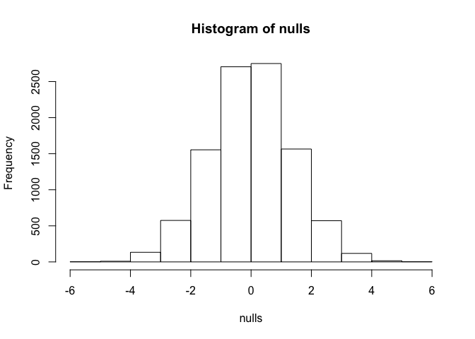

Introduction to Null Distribution
================

``` r
library(dplyr)
```

``` r
dat <- read.csv("femaleMiceWeights.csv")

control <- filter(dat, Diet=="chow") %>%
  select(Bodyweight) %>% unlist

treatment <- filter(dat, Diet=="hf") %>%
  select(Bodyweight) %>% unlist

obs <- mean(treatment) - mean(control)
obs
```

    ## [1] 3.020833

Difference in mice weights for high fat diet compared to control diet, based on sample size of 12.
Is this difference due to chance? Load in entire population and unlist

``` r
population <- read.csv("femaleControlsPopulation.csv")
population <- unlist(population)
```

Want to see what happens when null hypothesis = true. The hypothesis that there is no significant difference between specified populations, any observed difference being due to sampling or experimental error.
e.g. no high fat diet effect
Assign control mice to treatment group, guaranteed no high fat diet effect
Also calculate a null distribution, all possible realisations under the null.
Calculate the difference in mean 10,000 times, save values into a vector by first creating an empty vector then running a for loop.

``` r
n <- 10000
nulls <- vector("numeric",n)
for(i in 1:n){
  control <- sample(population, 12)
  treatment <- sample(population, 12)
  nulls[i] <- mean(treatment) - mean(control)
}
```

Now we can look at the values we get, for example the maximum

``` r
max(nulls)
```

    ## [1] 5.1925

Or we can make a histogram

``` r
hist(nulls)
```



The histogram represents the null distribution of this random variable. Now we can get a sense of how likely it is to see a value of 3 (the observation) under the null hypothesis.
Provides us with scientific support based on statistical inference.
We want to make a p-value: The proportion of times that the null distribution is larger than what we observed.
First we count how often it happens (sum), then divide it by n to get the proportion of times.

``` r
sum (nulls > obs) /n
```

    ## [1] 0.013

Can also type mean null over obs because sum/n = mean.

``` r
mean (nulls > obs) 
```

    ## [1] 0.013

We can also compute how often it is bigger in absolute value

``` r
mean(abs(nulls)>obs)
```

    ## [1] 0.0267

This is called the p-value, or the answer to the question "what is the probability that an outcome from the null distribution is bigger than what we observed, when the null hypothesis is true"
