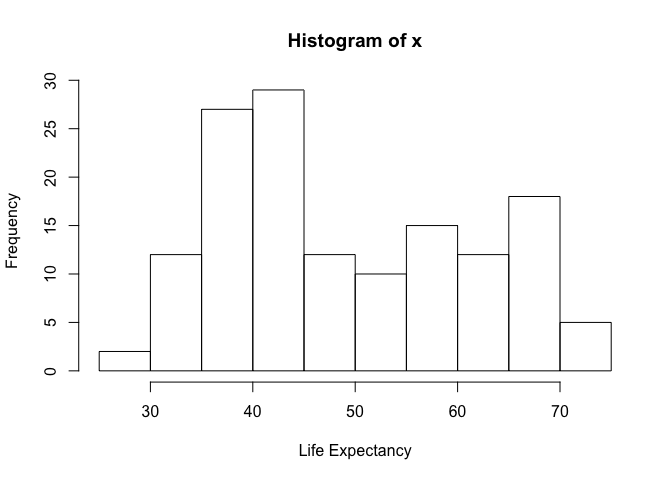
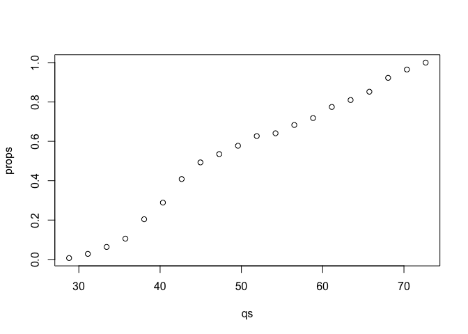
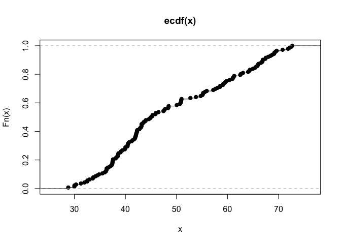

Probability Distributions Questions
================

### Intro

In the probability distribution notes, I looked at distributions of heights, and asked what was the probability of someone being shorter than a given height. In this assessment, I are going to ask the same question, but instead of people and heights, I am going to look at whole countries and the average life expectancy in those countries. I will use the data set called "Gapminder" which is available as an R-package on Github. This data set contains the life expectancy, GDP per capita, and population by country, every five years, from 1952 to 2007.

``` r
library(gapminder)
library(dplyr)
```

Create a vector 'x' of the life expectancies of each country for the year 1952. Plot a histogram of these life expectancies to see the spread of the different countries.

``` r
x <- filter(gapminder, year=="1952") %>% select(lifeExp) %>% unlist
```

    ## Warning: package 'bindrcpp' was built under R version 3.4.4

``` r
hist(x, xlab = 'Life Expectancy')
```

 1. In statistics, the empirical cumulative distribution function (or empirical cdf or empirical distribution function) is the function F(a) for any a, which tells you the proportion of the values which are less than or equal to a.

We can compute F in two ways: the simplest way is to type mean(x &lt;= a). This calculates the number of values in x which are less than or equal a, divided by the total number of values in x, in other words the proportion of values less than or equal to a.

The second way, which is a bit more complex for beginners, is to use the ecdf() function. This is a bit complicated because this is a function that doesn't return a value, but a function.

Let's continue, using the simpler, mean() function.

What is the proportion of countries in 1952 that have a life expectancy less than or equal to 40?

``` r
mean (x <= 40)
```

    ## [1] 0.2887324

1.  What is the proportion of countries in 1952 that have a life expectancy between 40 and 60 years? Hint: this is the proportion that have a life expectancy less than or equal to 60 years, minus the proportion that have a life expectancy less than or equal to 40 years.

``` r
mean(x <= 60) - mean(x <=40)
```

    ## [1] 0.4647887

### sapply() on a custom function

Suppose we want to plot the proportions of countries with life expectancy 'q' for a range of different years. R has a built in function for this, plot(ecdf(x)), but suppose we didn't know this. The function is quite easy to build, by turning the code from question 1 into a custom function, and then using sapply(). Our custom function will take an input variable 'q', and return the proportion of countries in 'x' less than or equal to q. The curly brackets { and }, allow us to write an R function which spans multiple lines:

``` r
prop = function(q){
  mean(x <=q)
}
prop(40)
```

    ## [1] 0.2887324

Now let's build a range of q's that we can apply the function to:

``` r
qs = seq(from=min(x),to=max(x), length=20)
qs
```

    ##  [1] 28.80100 31.10989 33.41879 35.72768 38.03658 40.34547 42.65437
    ##  [8] 44.96326 47.27216 49.58105 51.88995 54.19884 56.50774 58.81663
    ## [15] 61.12553 63.43442 65.74332 68.05221 70.36111 72.67000

Now we can use sapply() to apply the 'prop' function to each element of 'qs':

``` r
props = sapply(qs,prop)
plot(qs,props)
```

 We could also have written it in one line by defining the 'prop' function but without naming it, called an "inline" or "anonymous" function

``` r
props = sapply(qs, function(q) mean(x<=q))
```

Compare with built in plot in R:

``` r
plot(ecdf(x))
```


