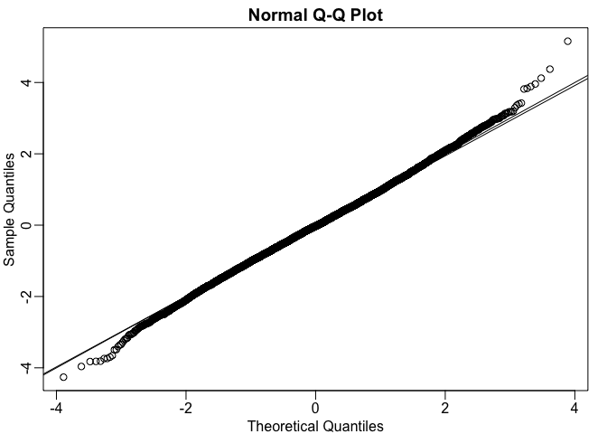
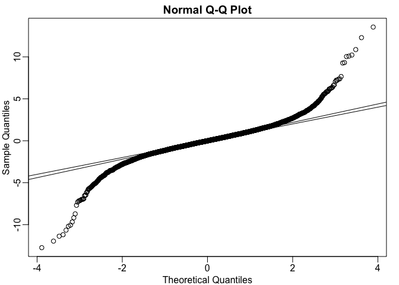

t-tests in practice
================

How is the CLT used in conjunction with t-statistics to obtain p-values? How can they be used to construct confidence intervals?

Lets use the mouse example, where we already constructed a difference in mean. Now we want to construct the *t-statistics*, and for that we need to estimate the standard error. We do that by taking the square root of the variance of the sample estimate divided by the sample size (N), added to the variance of the control divided by N - and we have an error estimate.

``` r
library(dplyr)
```

``` r
dat <- read.csv("femaleMiceWeights.csv")

control <- filter(dat, Diet=="chow") %>%
  select(Bodyweight) %>% unlist

treatment <- filter(dat, Diet=="hf") %>%
  select(Bodyweight) %>% unlist

N <- length(treatment)
obs <- mean(treatment) - mean(control)
se <- sqrt(
  var(treatment)/N+var(control)/N)
```

Now we can form a t-statistic by simply dividing the observed difference by its estimated standard deviation. The t-statistic is defined as the ratio of the departure of the estimated value of a parameter from its hypothesised value to its standard error.

``` r
tstat <- obs / se
```

What is useful about CLT is that if we assume that the normal approximation holds for the null distribution, then we don't need to have access to the population data. So in this realistic situation, we can compute a p-value. The t-statistic in CLT is telling us the null distribution is approximated by a normal distribution with mean 0 and variance 1. The function pnorm tells us what proportion of normally distributed data are lower than whatever value you choose.

``` r
1 - pnorm(tstat)
```

    ## [1] 0.0199311

This shows us the proportion of normally distributed data bigger than the tstat. We now multiply by 2 to get the 2 tails.

``` r
2*(1-pnorm(tstat))
```

    ## [1] 0.0398622

How good of an approximation is this? We can use the population data to test it. Now we divide the nulls by the standard error estimate - giving us the acutal null distribution of that t-statistic (CLT assumes it is normally distributed). We can make a QQ plot against the normal for these nulls.

``` r
population <- read.csv("femaleControlsPopulation.csv")
population <- unlist(population)

set.seed(1)
n <- 10000
nulls <- vector("numeric",n)
for(i in 1:n){
  control <- sample(population, N)
  treatment <- sample(population, N)
  se <- sqrt(
  var(treatment)/N+var(control)/N)
  nulls[i] <- (mean(treatment) - mean(control))/se
}

library(rafalib)
mypar()
qqnorm(nulls)
abline(0,1)
qqline(nulls)
```

 Quite close to the line, telling us that the CLT is giving us a pretty good approximation. The p-value we obtained is a good approximation of the acutal p-value. Lets see what happens with n = 3 instead of 12.

``` r
population <- read.csv("femaleControlsPopulation.csv")
population <- unlist(population)

set.seed(1)
n <- 10000
nulls <- vector("numeric",n)
for(i in 1:n){
  control <- sample(population, 3)
  treatment <- sample(population, 3)
  se <- sqrt(
  var(treatment)/3+var(control)/3)
  nulls[i] <- (mean(treatment) - mean(control))/se
}

library(rafalib)
mypar()
qqnorm(nulls)
abline(0,1)
qqline(nulls)
```

 This is not very good. There are values much bigger than what are predicted by the normal. So the normal approximation is not good at all with this small sample size. In this case if we would have instead used the t-approximation then it would have worked.
