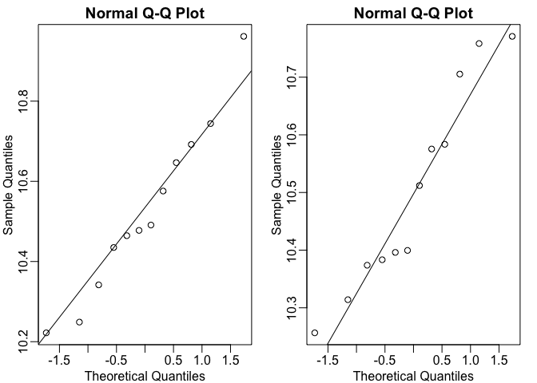

Challenge of Multiple Testing
================

``` r
library(GSE5859Subset)
data(GSE5859Subset)
```

Suppose that we are asked to find genes that are differentially expressed between cases and controls. We compare the average from the cases to the average of the controls. We want to attach statistical uncertainty to these summaries.

What we do is get the cases and controls from the sample info and then simplify the analysis to just one feature - then do the same analysis for the rest of them. Let's pick number 25.

``` r
g <- sampleInfo$group
e <- geneExpression[25,]
```

To compare cases and control we can do a t-test, but we need to know if the data is from a normal distribution. We make a qq plot.

``` r
library(rafalib)
mypar(1,2)

qqnorm(e[g==1])
qqline(e[g==1])

qqnorm(e[g==0])
qqline(e[g==0])
```

 They look good, like normal distributions. So we apply a t-test and see what we get.

``` r
t.test(e[g==1],e[g==0])
```

    ## 
    ##  Welch Two Sample t-test
    ## 
    ## data:  e[g == 1] and e[g == 0]
    ## t = 0.28382, df = 21.217, p-value = 0.7793
    ## alternative hypothesis: true difference in means is not equal to 0
    ## 95 percent confidence interval:
    ##  -0.1431452  0.1884244
    ## sample estimates:
    ## mean of x mean of y 
    ##  10.52505  10.50241

So the p-value is not small, and we would not call it significant. This is just for one feature, and we want to know about all of the other genes. One way to do this:

``` r
mytest <- function(x){
  t.test(x[g==1],x[g==0],var.equal = TRUE)$p.value
}

pvals <- apply(geneExpression,1,mytest)
sum(pvals <= 0.05)
```

    ## [1] 1383

``` r
sum(pvals <= 0.01)
```

    ## [1] 417

So we can see how many p values are less than 0.05, or 0.01. But there is a problem with this approach. How would this procedure work if we had an example where we know for sure that our data is ALL random, there is no differences. Let us simulate that with a Monte Carlo simulation.

``` r
m <- nrow(geneExpression)
n <- ncol(geneExpression)
randomData <- matrix(rnorm(n*m),m,n)

nullpvals <- apply(randomData,1,mytest)
sum(nullpvals <= 0.05)
```

    ## [1] 442

``` r
sum(nullpvals <= 0.01)
```

    ## [1] 89

This shows that we cannot just report the features with a p value less than 0.05 when we are testing thousands of possibilities. This will generate many false positives, even when the null hypothesis is true for all of the features.
