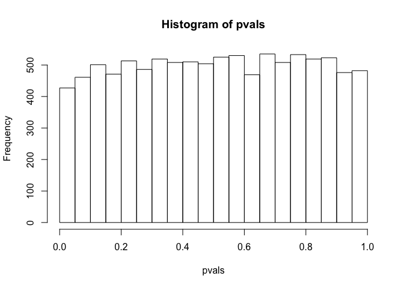
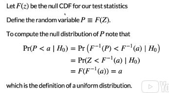

p-values Are Random Variables
================

In high-throughput experiments, the standard approach of using p-values is not useful. This is because p-values are random variables. To explain this, suppose Z is a test statistic e.g. a t-statistic. If we use the CLT approximation then:

``` r
#p <- 2*(1-pnorm(abs(Z)))
```

Z is a random variable, therefore p is also a random variable. Let us show this with a simulation. We take the control population of mouse weights, and taking random samples of size 12 to create a null distribution (10,000 times). Then we compute a t-statistic comparing these two populations that are really the same.

``` r
population <- read.csv("femaleControlsPopulation.csv")[,1]
N <- 12
B <- 10000
pvals <- replicate(B,{
  control <- sample(population,N)
  treatment <- sample(population,N)
  t.test(treatment,control)$p.val
  })
hist(pvals)
```

 The p-values we generate from this simulation are all constructed under the null distribution. But each time we run the t-statistic we generate a new p-value, and it changes. It is different every time because it is a random variable. The histogram of p-values is a uniform distribution.

Under the null hypothesis, p-values follow a uniform distirbution.



F is the CDF for our test statistic, then we define the random variable P as the evluation of Z with this function F. To complete the proof, we show that the the probability that p is less than a constant "a: under a null hypothesis, can be shown to be a. This is the definition of a uniform distribution. So under the null hypothesis, the p-values follow a uniform distribution.
