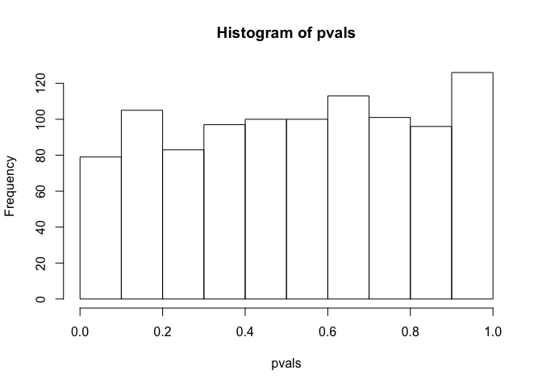

Inference in Practice Exercises
================

These exercises will help clarify that p-values are random variables and some of the properties of these p-values. Note that just like the sample average is a random variable because it is based on a random sample, the p-values are based on random variables (sample mean and sample standard deviation for example) and thus it is also a random variable.

To see this, let's see how p-values change when we take different samples.

``` r
set.seed(1)
library(downloader)
url=
  "https://raw.githubusercontent.com/genomicsclass/dagdata/master/inst/extdata/femaleControlsPopulation.csv"
filename = "femaleControlsPopulation.csv"
if(!file.exists(filename)) download(url,destfile=filename)
population = read.csv(filename)
pvals <- replicate(1000,{
  control = sample(population[,1],12)
  treatment = sample(population[,1],12)
  t.test(treatment,control)$p.val
})
head(pvals)
```

    ## [1] 0.9758457 0.4723582 0.2068672 0.7023475 0.9407852 0.0723841

``` r
hist(pvals)
```



### Exercise 1

What proportion of the p-values is below 0.05?

``` r
mean(pvals<0.05)
```

    ## [1] 0.041

### Exercise 2

What proportion of the p-values is below 0.01?

``` r
mean(pvals<0.01)
```

    ## [1] 0.008

### Exercise 3

Assume you are testing the effectiveness of 20 diets on mice weight. For each of the 20 diets you run an experiment with 10 control mice and 10 treated mice. Assume the null hypothesis that the diet has no effect is true for all 20 diets and that mice weights follow a normal distribution with mean 30 grams and a standard deviation of 2 grams, run a Monte Carlo simulation for one of these studies:

``` r
cases = rnorm(10,30,2)
controls = rnorm(10,30,2)
t.test(cases,controls)
```

    ## 
    ##  Welch Two Sample t-test
    ## 
    ## data:  cases and controls
    ## t = 0.16473, df = 17.934, p-value = 0.871
    ## alternative hypothesis: true difference in means is not equal to 0
    ## 95 percent confidence interval:
    ##  -1.708669  1.999327
    ## sample estimates:
    ## mean of x mean of y 
    ##  30.23172  30.08639

Now run a MC simulation imitating the results for the experiment for all 20 diets. If you set the seed at 100 and use the same code as above inside a call to replicate, how many p-values are below 0.05?

``` r
set.seed(100)
pvals <- replicate(20,{
  cases = rnorm(10,30,2)
  controls = rnorm(10,30,2)
  t.test(cases,controls)$p.val
})

sum(pvals < 0.05)
```

    ## [1] 1

### Exercise 4

Now create a simulation to learn about the distribution of the number of p-values that are less than 0.05. In question 1.2.3 we ran the 20 diet experiment once. Now we will run these 20 experiments 1,000 times and each time save the number of p-values that are less than 0.05.

Set the seed at 100 again, set.seed(100), run the code from Question 1.2.3 1,000 times, and save the number of times the p-value is less than 0.05 for each of the 1,000 instances.

What is the average of these 1,000 numbers? Note that this is the expected number of tests (out of the 20 we run) that we will reject when the null is true. (Hint: use replicate twice).

``` r
set.seed(100)

simulation <- replicate(1000,{
   pvals = replicate(20,{
    cases = rnorm(10,30,2)
    controls = rnorm(10,30,2)
    t.test(cases,controls)$p.val
  })
  sum(pvals<0.05)
})
table(simulation)
```

    ## simulation
    ##   0   1   2   3   4   6 
    ## 354 374 193  71   7   1

``` r
mean(simulation)
```

    ## [1] 1.007

### Exercise 5

Note that what the answer to question \#4 says is that on average, we expect some p-value to be 0.05 even when the null is true for all diets.

Using the same simulation data from the question above, for what proportion of the 1,000 replications do we reject the null hypothesis at least once (more than 0 false positives)? (Enter your response as a decimal value -- i.e. 0.10 for 10%.)

``` r
mean(simulation>0)
```

    ## [1] 0.646
