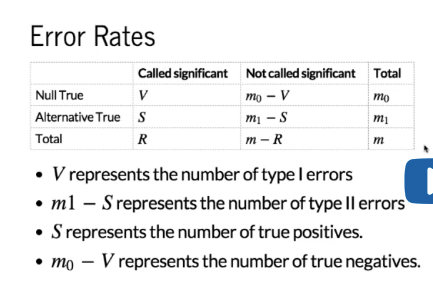
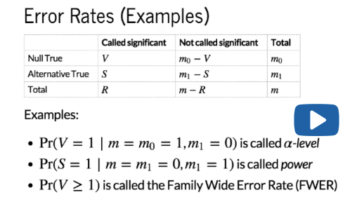

Erorr Rates and Procedures
================

These concepts are useful when performing inference on a HT experiment. We typically run many many tests for HT experiments, so the p-value concept is no longer useful (as we have shown).

A procedure is simply a recipe that tells us which results we call significant. We can make these procedures flextible through parameters or cutoffs. A simple example is to pick an alpha, compute a p-value for each feature, then call significant features with p-values smaller than that alpha. This would result in certain results being called significant, and another group not being called significant.

Once we have this, we can define error rates. Here's a table showing the types of mistakes we can make when we run such procedures on HT data.

We define the total number of tests that we compute with m. For example, measuring gene expression on say 20,000 genes would mean that m = 20,000. The other number we know in the table is R.R is the number of results called significant (some may be mistakes, some may be correct). Of the tests that result in calls of significance, V is the total number of cases where the null hypothesis is true (mistake - type I error, false positive). S is the number of tests called significant where the alternative is true (correct). We can also define type II being m1 = the total number of cases where the alternative is true - S. These are cases that were not called significant where we should have called them significant.

Once we have defined all of these error rates, we can define procedures and how we control the error rates for these procedures. The first example is a case where we only run one test (not a HT experiment).

m = 1, and we assume that the null hypothesis is true. m0 = 1 and m1 = 0. There is only one test, and the alternative is not true, the null is true. The probability of seeing one error, or making one type I error is simply the alpha level.

Another simple case is when we know the alternative is true. Under the assumption that the alternative is true, the probability that S = 1 is called power. This is the probability of detecting a difference when it is there.

A more complex example is when we define the Family Wide Erorr Rate. Here we have perofrmed many tests, m is very large. What we try to estimate and control is the probability that we make one or more mistake (we want a small value). Next, we will define procedures where we know that this probability is small, and control the FWER.
