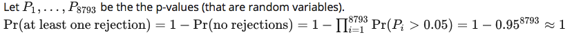
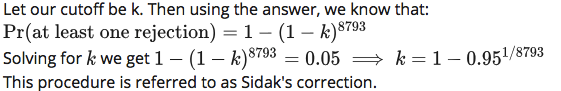

Erorr Rates and Procedures Exercises
================

In this assessment we hope to help you further grasp the concept that p-values are random variables and start laying the ground work for the development of procedures that control error rates. The calculations to compute error rates require us to understand the random behavior of p-values.

We are going to ask you to perform some calculations related to introductory probability theory. One particular concept you need to grasp is statistical independence. You also will need to know that the probability of two random events that are statistically independent occurring is P( A and B) = P(A)P(B). Note that this is a consequence of the more general formula P(A and B) = P(A) P(B | A )

### Exercise 1

Assume the null is true and denote the p-value you would get if you ran a test as P. Define the function f(x) = Pr(P =&lt; x). What does f(x) look like? The identity line.

### Exercise 2

In the previous assessment we saw how the probability of incorrectly rejecting the null for at least one of 20 experiments for which the null is true is well over 5%. Now let's consider a case in which we run thousands of tests as we would do in a high throughput experiment.

We previously learned that under the null, the probability of a p-value &lt; p is p. If we run 8,793 independent tests, what is the probability of incorrectly rejecting at least one of the null hypotheses? 1 

``` r
B <- 1000
minpval <- replicate(B,min(runif(8793,0,1))<0.05) 
#runif generates value from uniform distribution between 0 and 1 8793 times (p-values)
#min finds the minimum value
#if this value is < 0.05 then set to TRUE - means there is at least one rejection
#repeat 1000 times
mean(minpval >=1)
```

    ## [1] 1

``` r
#proportion of times out of 1000 repetitions that there is at least one rejection
```

### Exercise 3

Suppose we need to run 8,793 statistical tests and we want to make the probability of a mistake very small, say 5%. Using the answer to exercise \#2, how small do we have to change the cutoff, previously 0.05, to lower our probability of at least one mistake to be 5%. 

``` r
B <- 1000
alphas <- 10^seq(-7,-4,0.1)
probs = sapply(alphas,function(alphas){
  minpval = replicate(B,min(runif(8793,0,1)) < alphas) 
  mean(minpval >=1)
})
alphas[which.min(abs(probs-0.05))]
```

    ## [1] 5.011872e-06
