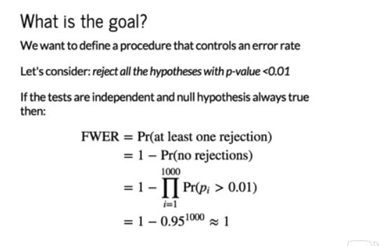
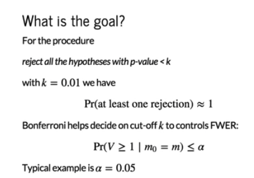
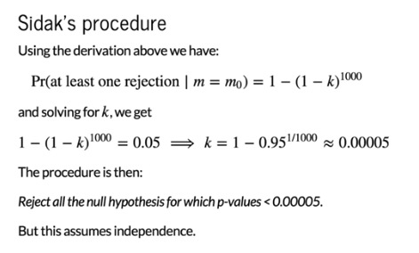
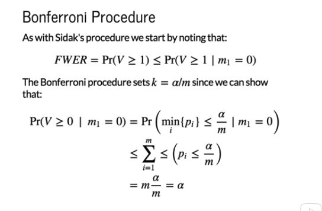

Bonferroni Correction
================

This will provide an example of a procedure for which we can control the familywise error rate. The first thing to remember is that if we define a procedure (e.g. reject all the hypotheses with p-value &lt; 0.01), then we assume that all of the tests are independent, we could show that the probability of making at least one mistake when we run e.g. 1,000 tests, follows these equations.

You can see that the probability of making at least one mistake is almost always practically one, even when all the hypotheses are null. This is not useful! You will almost always make a mistake. We want to make the probability of making a mistake small. Another approach is the Bonferroni correction.

Let's define am ore general procedure: We will reject all hypotheses with a p-value &lt; k.

So we will make k equal to 0.01, and we are running 1,000 tests. Again, the familywise error is almost one. We want to come up with a procedure that makes the probability of V being greater than or equal to 1, smaller than e.g. a quantity alpha. Let's make alpha 0.05.

Before getting to Bonferroni we will explain Sidak's procedure which is similar. We can figure out what k needs to be so that we know that the probability of making at least one mistake under the case where all the nulls are true is 0.05. In this case where we have 1,000 tests, the number k is 0.00005. Every time our p-value is smaller than that number, we call it significant. Assuming all tests are independent, we are controlling the familywise error rate at 0.05.

However, it is not always the case that the tests are independent. For example, in biology if you're testing many genes and we know that the genes work together, they will not be independent. Therefore this assumption is no longer valid. Bonferonni gives us a way to control the error rate without having to assume that all tests are independent.

What we show is that if we define our cutoff as alpha divided by m (total number of tests), then we control the familywise error rate at the level of alpha.
