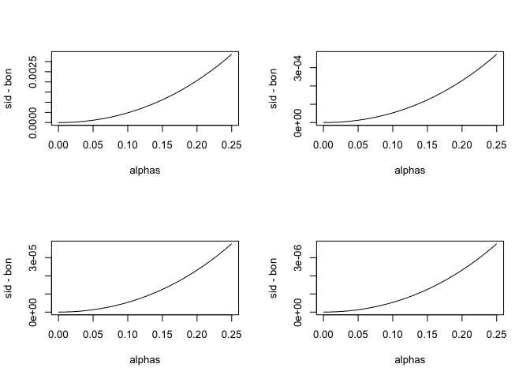

Bonferroni Exercises
================

This assessment should help you understand the concept of a error controlling procedure. You can think of it as defnining a set of instructions, such as "reject all the null hypothesis for for which p-values &lt; 0.0001" or "reject the null hypothesis for the 10 features with smallest p-values". Then, knowing the p-values are random variables, we use statistical theory to compute how many mistakes, on average, will we make if we follow this procedure. More precisely we commonly bounds on these rates, meaning that we show that they are smaller than some predermined value.

As described in the video, we can compute different error rates. The FWER tells us the probability of having at least one false positive. The FDR is the expected rate of rejected null hypothesis.

Note 1: the FWER and FDR are not procedures but error rates. We will review procedures here and use Monte Carlo simulations to estimate their error rates.

Note 2: We sometimes use the colloquial term "pick genes that" meaning "reject the null hypothesis for genes that."

### Exercise 1

So we have learned about the family wide error rate FWER. This is the probability of incorrectly rejecting the null at least once. Using the notation in the video this probability is written like this: Pr(V&gt;0).

What we want to do in practice is to choose a procedure that guarantees this probability is smaller than a predetermined value e.g. 0.05. Let us call it alpha.

We have already seen that the procedure "pick all genes with p-value &lt; 0.05" fails as Pr (V&gt;0) ≈ 1.

The Bonferroni procedure assumes we have computed p-values for each test and asks what constant k we should pick so that the proecure "pick all genes with p-values &lt; k" has Pr(V&gt;0) = 0.05. To be conservative rather than lenient, we accept a procedure with Pr(V&gt;0) =&lt; 0.05.

So the first result we rely on is that this probability is largest when ALL the null hypothesis are true:
Pr(V&gt;0) =&lt; Pr(V&gt;0 | all nulls are true)

Or using the video notation:
Pr(V&gt;0) =&lt; Pr(V&gt;0 | m1 = 0)

In an earlier assessmen twe showed that if tests are independent then:
Pr(V&gt;0 | m1 = 0) = 1 - (1 - k)^m

And we pick k so that 1 - (1 - k)^m = alpha =&gt; k = 1 - (1 - alpha)^(1/m)

This requires the tests to be independent. The Bonferroni procedure does NOT make this assumption and as we saw previously, if we set k = alpha/m, this procedure has the property that Pr(V&gt;0) =&lt; alpha.

Make a plot of a/m and 1 - (1 - a)^(1/m) for various values of m1. Which procedure is more conservatives (rejects less NHs)?
Bonferroni. Produces lower ks.

``` r
alphas <- seq(0,0.25,0.01)

par(mfrow=c(2,2))
for(m in c(10,100,1000,10000)){
  bon = alphas/m
  sid = 1 - (1-alphas)**(1/m)
  plot(alphas, sid-bon,type="l")
}
```



### Exercise 2

Monte Carlo simulation. To simulate the p-value results of, say, 8,793 t-tests for which the null is true we don't actual have to generate the original data. As we learned in class we can generate p-values from a uniform distribution like this:

``` r
pvals <- runif(8793,0,1)
```

Using what we have learned, set the cutoff using the Bonferroni correction that guarantees an FWER lower than 0.05 and report back the FWER. Set the seed at 1, set.seed(1) and run 10,000 simulation. Report the Monte Carlo estimate of the FWER below.

``` r
alpha <- 0.05
m <- 8793
k <- alpha/m
B <- 10000


set.seed(1)
minpval <- replicate(B,min(runif(8793,0,1)) <= k) 
mean(minpval >=1)
```

    ## [1] 0.0464

### Exercise 3

Using the same seed repeat the above for Sidak's cutoff.

``` r
alpha <- 0.05
m <- 8793
k <- 1 - (1-alpha)**(1/m)
B <- 10000


set.seed(1)
minpval <- replicate(B,min(runif(8793,0,1)) <= k) 
mean(minpval >=1)
```

    ## [1] 0.0473
