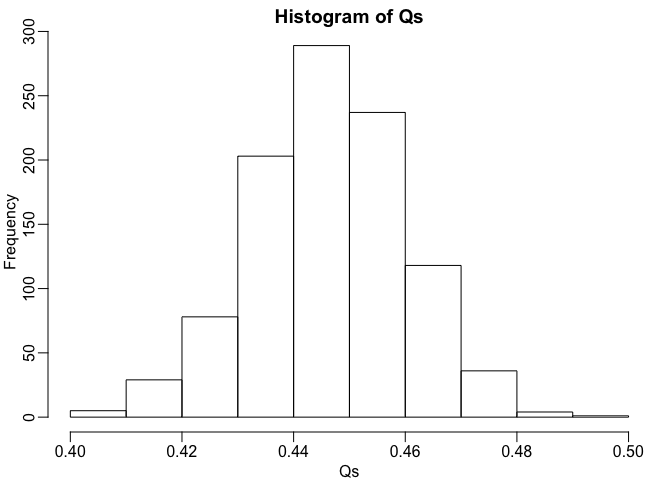
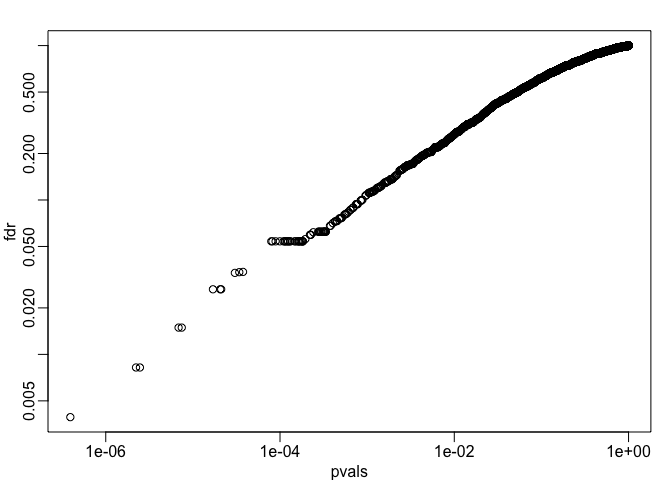
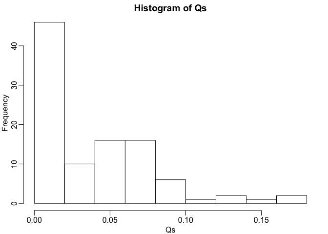

False Discovery Rate
================

``` r
library(genefilter)
library(downloader)
library(rafalib)
population <- unlist(read.csv("femaleControlsPopulation.csv"))
set.seed(1)
```

We are going to use Monte Carlo simulation to illustrate and motivate the false discovery rate (FDR). We will start by creating a simulation like one we did before where we are testing 10,000 diets. 10% make the mice heavier, 90% don't. When it does, the mice are on average 3g heavier. We will use the vectorised approach as it is much faster. We now have a matrix, with data, cases and controls in two sets of columns that you can decipher from the vector "g". Then we use a row t-test to test for each one of these 10,000 diets, and see if the cases and controls are different. We do a Bonferroni corretion, at the 0.05 level. So out of the 10,000 diets, where 1,000 have a difference, we see only 3 are called significant with the Bonferroni correction.

``` r
alpha <- 0.05
N <- 12
m <- 10000
p0 <- 0.90
m0 <- p0*m
m1 <- m-m0
nullHypothesis <- c(rep(TRUE,m0),rep(FALSE,m1))
delta <- 3

controls <- matrix(sample(population,N*m,replace=TRUE),nrow=m)
treatments <- matrix(sample(population,N*m,replace=TRUE),nrow=m)

treatments[which(!nullHypothesis),] <- treatments[which(!nullHypothesis),]+delta

#Combine to form one matrix
dat <- cbind(controls,treatments)
g <- factor(c(rep(0,N),rep(1,N)))

pvals <- rowttests(dat,g)$p.value

sum(pvals <= alpha/m)
```

    ## [1] 3

There is a small probability of making a mistake, however we only called 3 out of 1,000 significant. That's a very high false negative rate. This is a problem with the Bonferroni regression, especially when using high throughput technology. Imagine searching for a gene that's associated with a disease, there are many false positives- even finding one is exciting. If you are requiring that you have a FWER of 0.05, you will never make a list with the gene you are looking to discover.

The false discovery rate gives more flexibility. What it does is defines the expected value of the proportion of features that have type I errors (called significant when they are not). We then try to minimise that rate. For example, we might request 50% FDR, meaning the expected error rate is 50%. That might not be a problem if we are going to then go on to corroborate and confirm our findings. So it is much more flexible in what we can get out of these high-throughput experiments.

First we define the procedure. If the p-value is &lt; 0.05, then call that gene significant. What would then be the FDR for that procedure? We define R, the number of calls, as the test for which p is less than 0.05. Here we find that around 1,000 of them are significant.

``` r
calls <- pvals <= alpha
R <- sum(calls)
R
```

    ## [1] 1017

We then define V, that is the false positives when the null hypothesis is true and we call it significant (type I)

``` r
V <- sum(nullHypothesis & calls)
V
```

    ## [1] 459

It is 459 with this procedure. Now we have Q, a new quantity we are defining which is V/R, unless R is 0, in which case we report 0.

``` r
Q <- ifelse(R>0,V/R,0)
Q
```

    ## [1] 0.4513274

We get 0.45. 45% of the tests that we are calling significant are false positives. But this is not the FDR- Q is just a random variable, and its expectation is related to the FDR. Now what we can do is run a Monte Carlo simulation that generates this random variable 1,000 times.

``` r
B <- 1000
Qs <- replicate(B,{
  controls <- matrix(sample(population,N*m,replace=TRUE),nrow=m)
  treatments <- matrix(sample(population,N*m,replace=TRUE),nrow=m)
  
  treatments[which(!nullHypothesis),] <- treatments[which(!nullHypothesis),]+delta

  #Combine to form one matrix
  dat <- cbind(controls,treatments)
  g <- factor(c(rep(0,N),rep(1,N)))

  calls <- rowttests(dat,g)$p.value < alpha
  
  R <- sum(calls)
  V <- sum(nullHypothesis & calls)
  Q <- ifelse(R>0,V/R,0)
  return(Q)
})
```

So the Qs are random variables, and the expectation is the FDR. Now we can make a histogram of the Qs to see that its a random variable, and what the distribution is like.

``` r
mypar(1,1)
hist(Qs)
```

 The value varies between 0.4 and 0.5. We can actually compute the FDR by taking the mean of the Qs.

``` r
FDR <- mean(Qs)
print(FDR)
```

    ## [1] 0.4463474

So the FDR is 0.45. Now, this is very high. If we want a procedure that has a FDR of say, 0.05, we can define that. We do this by using the Benjamini-Hochberg procedure, which gives us a way of selecting a p-value so that the FDR is less than any value we want. The p.adjust function in R lets you compute the Benjamini-Hochberg value for a list of p-values.

You generate a list of p-values and it gives you an FDR for each one: it is telling you that if you use these different p-value cutoffs, this is the FDR that you would get for that cutoff.

``` r
fdr <- p.adjust(pvals,method="fdr")
mypar(1,1)
plot(pvals,fdr,log="xy")
```



Now we will run the simulation, and call things significant if the Benjamini-Hochberg correction is less than 0.05.

``` r
B <- 100
alpha <- 0.05
res <- replicate(B,{
  controls <- matrix(sample(population,N*m,replace=TRUE),nrow=m)
  treatments <- matrix(sample(population,N*m,replace=TRUE),nrow=m)
  
  treatments[which(!nullHypothesis),] <- treatments[which(!nullHypothesis),]+delta

  #Combine to form one matrix
  dat <- cbind(controls,treatments)
  g <- factor(c(rep(0,N),rep(1,N)))

  pvals <- rowttests(dat,g)$p.value
  calls <- p.adjust(pvals,method="fdr") < alpha
  
  R <- sum(calls)
  V <- sum(nullHypothesis & calls)
  Q <- ifelse(R>0,V/R,0)
  return(c(R,Q))
})
Qs <- res[2,]
mypar(1,1)
hist(Qs)
```



``` r
FDR <- mean(Qs)
print(FDR)
```

    ## [1] 0.03721344

So we now have an FDR of less than 0.05. So we have now controlled the FDR using the Benjamini-Hochberg procedure. Bonferroni controls FWER, Benjamini-Hochberg controls the FDR.
