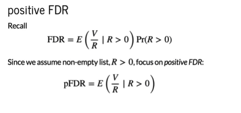
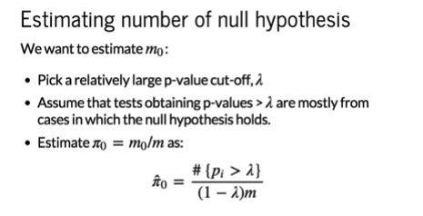
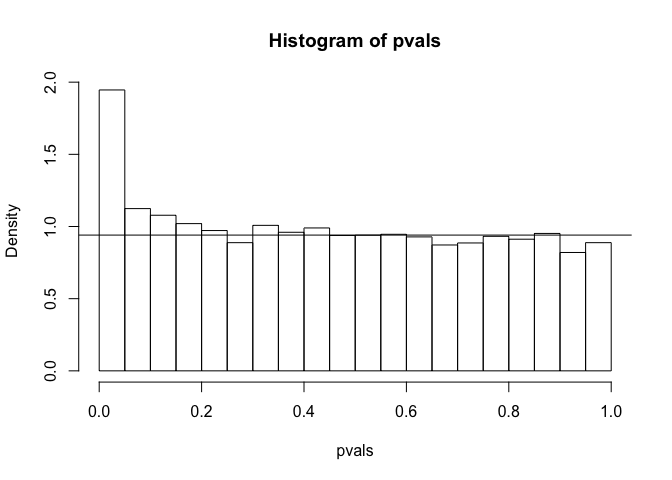
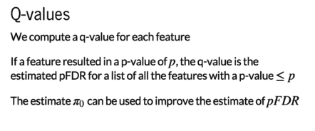

q-values
================

``` r
library(genefilter)
population <- read.csv("femaleControlsPopulation.csv")
population <- unlist(population)
```

We have explained what the false discovery rate is, and we've explained the Benjamini-Hochberg procedure that controls FDR at a certain level.
In high-throughput experiments, it's very common to make some kind of list. This motivates another approach to assigning uncertainty levels in high-throughput experiments, called the direct approach to FDR.

### Direct Approach to FDR

What we're going to do is, instead of trying to define a procedure that controls the FDR at a given level, we're going to just make a list (R&gt;0) and then estimate the FDR for that list. Once we do that, then we'll define q-values. It's almost always the case, that when we have run a high-throughput experiment we are going to make a list. R &gt; 0, we will always call something significant.
 So going back to the definition of the false discovery rate, shown in the top equation. We notice that the equation is general for any R, so it applies for procedures that sometimes result in lists that are empty. But since we are assuming that R &gt; 0, we're going to set focus on the part of the equation where we assume that R is bigger than zero. This is called the *positive false discovery rate*.

Another thing we can do is estimate the number of null hypotheses.  What we're doing is taking advantage of the fact that we have many tests, to try and estimate pi\_0. Pi\_0 is a proportion of tests for which the null hypothesis is true.
The general idea is that we pick a relatively large p-value, lambda, then basically make a histogram. For tests for which the p-value is larger than this alpha, we assume that they are from cases in which the null hypothesis holds. We then use this equation at the bottom to estimate pi\_0.

So, taking this example of simulated p-values with p0 = 0.9:

``` r
alpha <- 0.05
N <- 12
m <- 10000
p0 <- 0.90
m0 <- p0*m
m1 <- m-m0
nullHypothesis <- c(rep(TRUE,m0),rep(FALSE,m1))
delta <- 3

controls <- matrix(sample(population,N*m,replace=TRUE),nrow=m)
treatments <- matrix(sample(population,N*m,replace=TRUE),nrow=m)

treatments[which(!nullHypothesis),] <- treatments[which(!nullHypothesis),]+delta

#Combine to form one matrix
dat <- cbind(controls,treatments)
g <- factor(c(rep(0,N),rep(1,N)))

pvals <- rowttests(dat,g)$p.value

lambda <- 0.1
pi0 <- sum(pvals > lambda)/((1-lambda)*m)
hist(pvals, prob=TRUE)
abline(h=pi0)
```



``` r
print(pi0)
```

    ## [1] 0.938

If we take an alpha of 0.1, and only look at values to the right of 0.1, then estimating this pi\_0 is basically the same as finding a line that fits the uniform distribution as we see in the picture. Once we have this, we can estimate pi\_0, in this case it is 0.94.
Once we have this value, we're ready to compute q-values.  We generate a list from our high throughput experiment, and define the q-value as follows. If a feature resulted in a q-value of, say p, then the q-value is the estimated PFDR for a list of all the features that have p-values smaller than p.
So if you take a gene, then you make a list that includes that gene, and it has a p that is just barely enough to incude that gene, then we compute PFDR for that list. We define that as the q-value.
Now we can assign a value to each gene (feature) as opposed to defining a procedure before we start the experiment. By estimating pi\_0, then we get an estimate of the positive FDR, which gives us an improved estimate of the q-value.
However, we can also define q-values with a standard estimate of FDR.
