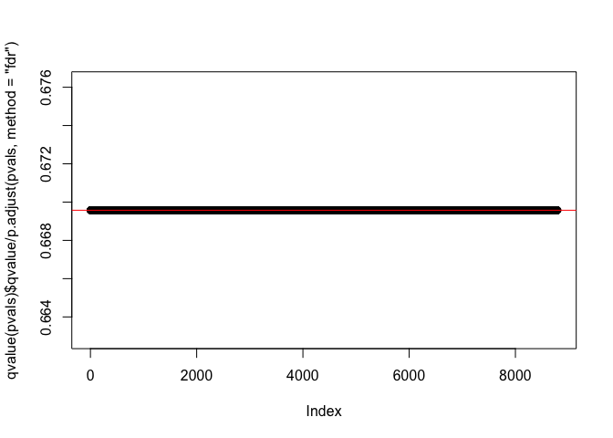

FDR Exercises
================

In this assessment we will define error controlling procedures for experimental data. We will make list of genes based on q-values. We will also assess your understanding of false positives rates and false negative rates by asking you to create a Monte Carlo simulation.

``` r
library(devtools)
```

    ## Warning: package 'devtools' was built under R version 3.4.4

``` r
library(rafalib)
install_github("genomicsclass/GSE5859Subset")
install_bioc("genefilter")
```

    ## 
    ## The downloaded binary packages are in
    ##  /var/folders/ps/cc8h34252m5493xyx_tchmrm0000gn/T//RtmpFSsX2M/downloaded_packages

``` r
install_bioc("qvalue")
```

    ## 
    ## The downloaded binary packages are in
    ##  /var/folders/ps/cc8h34252m5493xyx_tchmrm0000gn/T//RtmpFSsX2M/downloaded_packages

### Exercise 1

``` r
library(GSE5859Subset)
data(GSE5859Subset)
```

We are interested in comparing gene expression between the two groups defined in the sampleInfo table.

Compute a p-value for each gene using the function rowttests from the genefilter package in Bioconductor.

``` r
library(genefilter)

alpha <- 0.05
g <- factor(sampleInfo$group)
pvals <- rowttests(geneExpression,g)$p.value

sum(pvals<alpha)
```

    ## [1] 1383

### Exercise 2

Apply the Bonferroni correction to the p-values obtained in question \#1 to achieve a FWER of 0.05. How many genes are called significant under this procedure?

``` r
m <- 8793
k <- alpha/m
sum(pvals < k)
```

    ## [1] 10

### Exercise 3

Note that the FDR is a property of a list of features, not each specific feature. The q-value relates FDR to an individual feature. To define the q-value we order features we tested by p-value then compute the FDRs for a list with the most significant, the two most significant, the three most significant, etc... The FDR of the list with the, say, m most significant tests is defined as the q-value of the m-th most significant feature. In other words, the q-value of a feature, is the FDR of the biggest list that includes that gene.

In R, we can compute the q-value using the p.adjust function with the FDR option. Read the help file for p.adjust and then, for our gene expression dataset, compute how many genes achieve an FDR &lt; 0.05

``` r
adjusted <- p.adjust(pvals,method="fdr")
sum(adjusted < alpha)
```

    ## [1] 13

### Exercise 4

Now use the qvalue function, in the Bioconductor qvalue package, to estimate q-values using the procedure described by Storey.

Using this estimate how many genes have q-values below 0.05?

``` r
library(qvalue)
qs <- qvalue(pvals)$qvalues
sum(qs < alpha)
```

    ## [1] 22

### Exercise 5

Read the help file for qvalue and report the estimated proportion of genes for which the null hypothesis is true

``` r
qvalue(pvals)$pi0
```

    ## [1] 0.6695739

### Exercise 6

Note that we have the number of genes passing the q-value &lt;0.05 threshold is larger with the qvalue function than the p.adjust difference.

Why is this the case? Make a plot of the ratio of these two estimates to help answer the question.

``` r
plot(qvalue(pvals)$qvalue/p.adjust(pvals,method="fdr"))
abline(h=qvalue(pvals)$pi0,col=2)
```



### Exercise 7

Create a Monte Carlo Simulation in which you simulate measurements from 8,793 genes for 24 samples: 12 cases and 12 controls.

``` r
n <- 24
m <- 8793
mat <- matrix(rnorm(n*m),m,n)
```

Now for 500 genes, there is a difference of 2 between cases and controls:

``` r
delta <- 2
positives <- 500
mat[1:positives,1:(n/2)] <- mat[1:positives,1:(n/2)]+delta
```

So the null hypothesis is true for 8793-500 genes. Using the notation from the videos m=8793, m0=8293 and m1=500

Set the seed at 1, set.seed(1) and run this experiment 1,000 times with a Monte Carlo simulation. For each instance compute p-values using a t-test (using rowttests in the genefilter package) and create three lists of genes using:

Bonferroni correction to achieve an FWER of 0.05, p-adjust estimates of FDR to achieve an FDR of 0.05, and qvalue estimates of FDR to to achieve an FDR of 0.05. For each of these three lists compute the number of false positives in the list and the number of false negatives: genes not in the list that should have been because the null hypothesis is not true (we added 2 to the controls to create the cases).

What is the false positive rate (false positives divided by m0) if we use Bonferroni?

``` r
m0 <- m - positives
m1 <- positives
nullHypothesis <- c(rep(FALSE,m1),rep(TRUE,m0))

set.seed(1)
library(qvalue)
library(genefilter)
n <- 24
m <- 8793
B <- 1000
delta <-2
positives <- 500
g <- factor(rep(c(0,1),each=12))
result <- replicate(B,{
  mat <- matrix(rnorm(n*m),m,n)
  mat[1:positives,1:(n/2)] <- mat[1:positives,1:(n/2)]+delta
  pvals = rowttests(mat,g)$p.val
  ##Bonferroni
  FP1 <- sum(pvals[-(1:positives)]<=0.05/m)  
  FN1 <- sum(pvals[1:positives]>0.05/m)
   #p.adjust q-value
  qvals1 = p.adjust(pvals,method="fdr")
  FP2 <- sum(qvals1[-(1:positives)]<=0.05)
  FN2 <- sum(qvals1[1:positives]>0.05)
  #qvalue q-value
  qvals2 = qvalue(pvals)$qvalue
  FP3 <- sum(qvals2[-(1:positives)]<=0.05)
  FN3 <- sum(qvals2[1:positives]>0.05)  
  (c(FP1,FN1,FP2,FN2,FP3,FN3))
  })

mean(result[1,]/(m0))
```

    ## [1] 5.305679e-06

``` r
mean(result[2,]/(m1))
```

    ## [1] 0.763252

``` r
mean(result[3,]/(m0))
```

    ## [1] 0.002737851

``` r
mean(result[4,]/(m1))
```

    ## [1] 0.081418

``` r
mean(result[5,]/(m0))
```

    ## [1] 0.002933076

``` r
mean(result[6,]/(m1))
```

    ## [1] 0.077302
