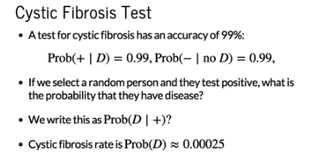
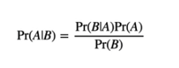
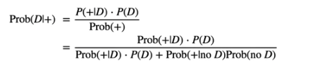
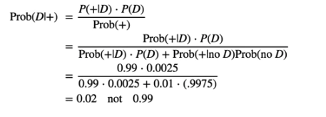

Bayes’ Rule
================

Imagine you are conducting a test for cystic fibrosis, and it's a very good test with an accuracy of 99%.

So the probability of obtaining a positive test if you have the disease is 99%. We assume this also applies to the other type of result we can get, the probability of a negative result when we don't have the disease.
If we randomly select a person from the population and they test positive, what is the probability that they have the disease? Here we are asking what is the probability of D assuming a positive test.

To work this out, we also need to now that the rate of cystic fibrosis in the population is very low, about 1 in 4,000 roughly, so the probability of having the disease given a positive test is very low - closer to 2% than 99%. Why? We will explain with Bayes' rule. 
The probability of A given B, is equal to the probability of B given A, times the probability of A, divided by the probability of B. Let's apply this to the CF test.

What we want to know is the probability of having the disease, given a positive test (LHS). Using Bayes' rule, we can relate this to quantities that we do know. We know the probability of a positive test, given the person having the disease (99%). We know the probability of the disease (1 in 4,000). We can compute the probability of a positive test by breaking it up into all the possible ways that we can get a positive test - positive when you have the disease, and positive when you don't have the disease. We know these quantities, so we can compute Prob(+).

So, it turns out that the probability of having the disease, given that you get a positive test, is actualy 0.02, not 0.99. Why does this happen despite the test being so accurate?
The main reason is because we have to take into account how unlikely it is to have the disease, regardless of what the test says.
