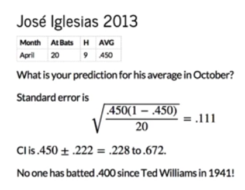
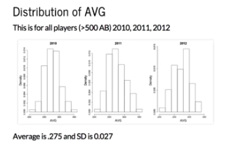
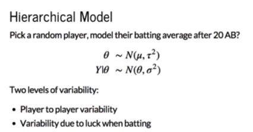
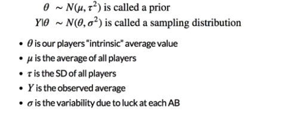
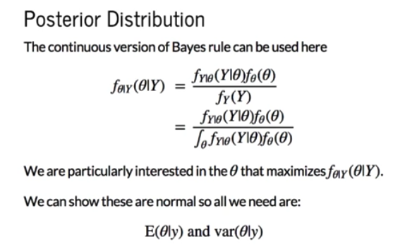
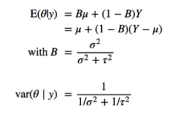
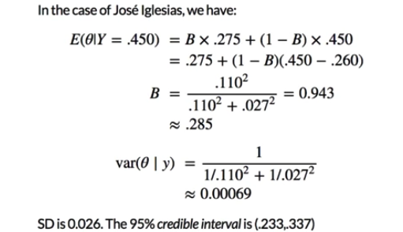

Bayes’ Rule in Practice
================

We are going to apply Bayes' rule to baseball, and it will serve as an introduction to hierarchical models. We are going to use the example of Jose Iglesias in April. He hadd 20 at bats, 9 hits, which is a batting average of 0.45 - he was successful 45% of the times he went to bat.

If he holds this throughout the season of batting, he will accomplish something that hasn't been done since 1941.
So at first let's point out that if we think of these bats as random variables that are either a success or not (0 or 1), this is a binomial. Each time he comes to bat, he is either successful or not, and they are independent. So we add them up, and divide by the number of bats (average). And the sum of successes, the number of hits, is going to follow a binomial distribution. We compute a standard error for the batting average - in this case it is 0.111. So we construct a confidence interval- 0.228 to 0.672. Even though he had a 0.450 batting average, no one was excited about this because people were using Bayes' rule in the back of their minds.

If we look at batters from a database for 2010, 2011 and 2012, and we look at the distribution of batting averages for all players that had at least 500 at bats, we see that no one got past 0.380. The average was around 0.275, with a SD of 0.027. For three years in a row there is a similar distribution, and it follows a normal distribution - which makes sense, as when we take a group of many people and look at random events, the distribution across a population tends to be normal.

What we're getting to here is that we are thinking of a hierarchical model where we have two levels. First, we pick a player at random (first level), and basically take a batting average from the distributions we just saw. Once we have this player, we look at 20 at bats and then look at the batting average (Y), assuming an intrinsic batting average for this player. Now, luck gets involved. When you hit the ball, you can have good luck or bad luck. You could hit the ball hard, but make an out. You can hit the ball not very hard, and actually have it be a success. This is where the binomal distribution came in.
So again, we have player to player variablity (first level of model) and then variability due to luck. There's two levels - hierarchical. There's an "everybody" level, then there's a specific player level. We use this to make a better prediction of Jose Iglesias' batting average. 
Theta is the player's intrinsic average value - you can think of it as how good they are naturally.
Mu is the average of all players.
Tau is the SD of all players - relates to those histograms shown earlier.
Y is the observed average after 20 at bats.
Sigma is the variability due to luck at each at bat. It's a binomial, so we will approximate it with a normal distribution.

So with the data that we had, we have that theta is normal with with an average of 0.275 and an SD of 0.027. Then Y, the batting average given theta, is a normal with the unknown theta (this is what we are trying to predict). Here we say that the SD is 0.11 from normal distribution. Now what we do is use a continuous version of Bayes' rule: 
It is a continuous version of Bayes' rule with parameteric distributions represented with f. What we're interested in is the average of theta, the quantity we want to predict. This is the intrinsic average of Jose Iglesias given the observations that we've seen in 20 at bats.
So we can compute the mean and the variance, and for the model that we have posed with a normal distribution, it turns out that we can compute these quantities relatively easily by using calculus.

It turns out that the average theta, given the data Y, is a linar combination of the mean of all the players mu, and the observed outcome for this particular batter after 20 at bats. The weight, beta has to do with how much variability there is due to chance in our Y, and how much variability there is across players. This makes sense, as if sigma is a very large number, this means there's a lot of variability in the observation that we are working with. Then B is going to be close to 1. If B is close to 1, then we practically ignore the data that we've seen, because it's very variable. Instead we go with the, let's just see what a randomly chosen player looks like.
So if B is a 1, we go with mu. If the opposite is true, if we have a lot of data and we have a very precise estimate (making sigma very small), B becomes almost 0. And instead, we use the data Y, going back to the equation. We can also then compute the variance for the prediction that we're going to make. That is given by the third equation above.

So let's do this for the data we have for Jose Iglesias. We plug in the values that we get, and we get a weight - the weight B is actually 0.94.

This is saying we give a lot of weight to the, let's just pick a random player part of the hierarchical model. Because the data that we have is only 20 at bats, that has a high variance, and we're not going to trust it too much. So the empirical Bayes' estimate of Jose Iglesias' batting average is 0.285, very different from 0.450, and the variance is very small. This turns out to have a standard deviation of 0.026.
So our original estimate was 0.450 +- 0.220, this is called a frequentist confidence interval, to distinguish it from an empirical Bayes' credible interval, which in this case is 0.285 +- 0.052. It turns out that the actual batting average, what he ended up batting the rest of the season was 0.293 (close to the 0.285 prediction that Bayes' rule predicted).

This is a clear example of where using Bayes' rule and empirical Bayes' approaches can greatle improve the estimates that we obtain for data in which we have a small number of observations, but we have many observations for many other players. The way this relates to life sciences is that for example in HT experiments, we may have few observations for a given feature, but we have many many features from which we can built hierarchical models.
