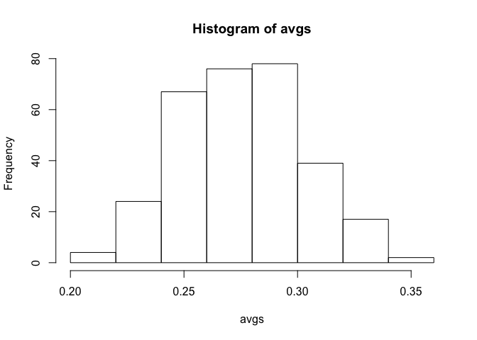
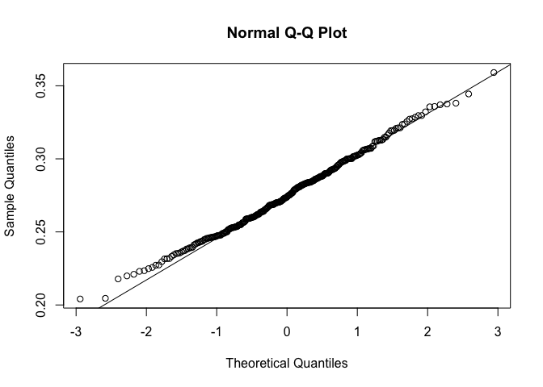
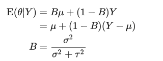

Bayes’ Rule in Practice Exercises
================

``` r
library(dplyr)
```

    ## Warning: package 'dplyr' was built under R version 3.4.4

``` r
tmpfile <- tempfile()
tmpdir <- tempdir()
download.file("http://seanlahman.com/files/database/lahman-csv_2014-02-14.zip",tmpfile)
##this shows us files
filenames <- unzip(tmpfile,list=TRUE)
players <- read.csv(unzip(tmpfile,files="Batting.csv",exdir=tmpdir),as.is=TRUE)
unlink(tmpdir)
file.remove(tmpfile)
```

    ## [1] TRUE

### Exercise 1

Which of the following dplyr commands gives us the batting averages (AVG) for players with more than 500 at bats (AB) in 2012:

``` r
filter(players,yearID==2012)%>%mutate(AVG=H/AB)%>%filter(AB>=500)%>%select(AVG)
```

    ## Warning: package 'bindrcpp' was built under R version 3.4.4

    ##           AVG
    ## 1   0.2257002
    ## 2   0.2732240
    ## 3   0.2899306
    ## 4   0.2438095
    ## 5   0.2861685
    ## 6   0.2884615
    ## 7   0.2500000
    ## 8   0.2901354
    ## 9   0.2536496
    ## 10  0.2342857
    ## 11  0.3211921
    ## 12  0.2687386
    ## 13  0.2740385
    ## 14  0.2880435
    ## 15  0.3193980
    ## 16  0.2517857
    ## 17  0.3127036
    ## 18  0.2702703
    ## 19  0.3295820
    ## 20  0.3125997
    ## 21  0.2832817
    ## 22  0.2826087
    ## 23  0.2459893
    ## 24  0.2598291
    ## 25  0.2699029
    ## 26  0.2273603
    ## 27  0.2805344
    ## 28  0.2628458
    ## 29  0.2923977
    ## 30  0.2040816
    ## 31  0.2804428
    ## 32  0.2925620
    ## 33  0.2526882
    ## 34  0.2474747
    ## 35  0.2841727
    ## 36  0.3132530
    ## 37  0.2352941
    ## 38  0.2592593
    ## 39  0.2934132
    ## 40  0.2859922
    ## 41  0.3030888
    ## 42  0.2943925
    ## 43  0.2315436
    ## 44  0.2846975
    ## 45  0.2383107
    ## 46  0.2701689
    ## 47  0.2704626
    ## 48  0.2864238
    ## 49  0.2691652
    ## 50  0.3021346
    ## 51  0.2954925
    ## 52  0.2317757
    ## 53  0.3127341
    ## 54  0.3001842
    ## 55  0.2455446
    ## 56  0.3162518
    ## 57  0.2248521
    ## 58  0.2870370
    ## 59  0.2872727
    ## 60  0.2564885
    ## 61  0.2571912
    ## 62  0.2983114
    ## 63  0.2529644
    ## 64  0.2714536
    ## 65  0.3192661
    ## 66  0.2426036
    ## 67  0.3271501
    ## 68  0.3148515
    ## 69  0.2601942
    ## 70  0.2673267
    ## 71  0.2415631
    ## 72  0.2907180
    ## 73  0.2876033
    ## 74  0.2895204
    ## 75  0.2391714
    ## 76  0.2810345
    ## 77  0.3358491
    ## 78  0.3014587
    ## 79  0.2850082
    ## 80  0.2647555
    ## 81  0.3000000
    ## 82  0.2230088
    ## 83  0.2422259
    ## 84  0.2935421
    ## 85  0.2866044
    ## 86  0.3041322
    ## 87  0.2500000
    ## 88  0.2524655
    ## 89  0.2465483
    ## 90  0.2592593
    ## 91  0.2620321
    ## 92  0.2829457
    ## 93  0.2718808
    ## 94  0.3255814
    ## 95  0.2683824
    ## 96  0.2198853
    ## 97  0.2460733
    ## 98  0.2797834
    ## 99  0.2554455
    ## 100 0.2295918
    ## 101 0.2490494
    ## 102 0.2601156
    ## 103 0.3063683
    ## 104 0.2665505
    ## 105 0.2765957
    ## 106 0.2820069
    ## 107 0.2696429

### Exercise 2

Edit the command above to obtain all the batting averages from 2010, 2011, 2012 and removing rows with AB &lt; 500.

What is the average of these batting averages?

``` r
years <- c(2010,2011,2012)
avgs <- filter(players,yearID %in% years)%>%mutate(AVG=H/AB)%>%filter(AB>=500)%>%select(AVG)%>%unlist
mean(avgs)
```

    ## [1] 0.2754028

### Exercise 3

What is the standard deviation of these batting averages?

``` r
sd(avgs)
```

    ## [1] 0.02739408

### Exercise 4

Use exploratory data analysis to decide which of the following distributions approximates the distribution of the average across players (hint: this is contained in the AVG component)? NORMAL

``` r
hist(avgs)
```



``` r
qqnorm(avgs)
qqline(avgs)
```



### Exercise 5

It is April and after 20 at bats, Jose Iglesias is batting .450 (this is very good). We can think of this as a binomial distribution with 20 trials with probability of success p. Our sample estimate of p is .450. What is our estimate of standard deviation? Hint: This AVG a sum of Bernoulli trials, that is binomial, divided by 20.

``` r
standarderror <- sqrt((.45*(1-.45)/20))
standarderror
```

    ## [1] 0.111243

### Exercise 6

The Binomial is approximated by normal when the sample size is large, so our sampling distribution is approximately normal with mean Theta = 0.45 and SD sigma = 0.11. Earlier we used a baseball database to determine that our prior distribution for Theta is Normal with mean mu = 0.275 and SD tau = 0.027. We saw that this is the posterior mean prediction of the batting average:
 What is your estimate of Jose Iglesias' batting average going forward, taking into account his current batting average?

``` r
sigma <- 0.11
theta <- 0.45
mu <- 0.275
tau <- 0.027
B <- (sigma^2)/(sigma^2 + tau^2)
E <- B*mu + (1-B)*theta
E
```

    ## [1] 0.2849443
