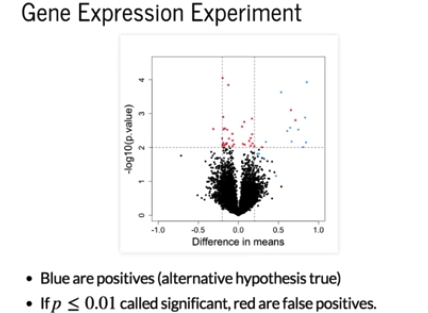
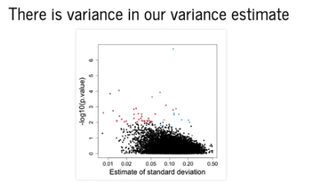
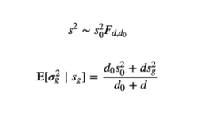
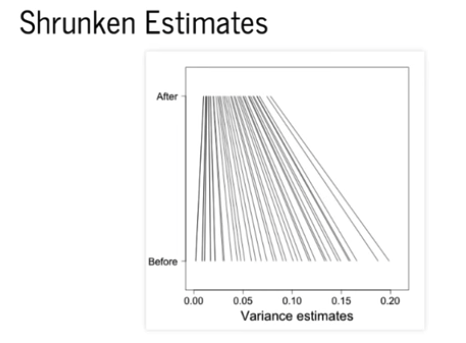
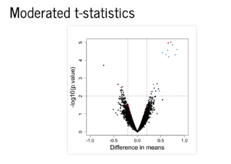

Hierarchical Models in Practice
================

We are going to talk about a very powerful method for the analysis of high throughput data. We will use an example from a gene expression experiment. This is an experiment where we compared a group of three.

So we have three cases and three controls. In this experiment there are 16 genes that are differentially expressed. We had 10,000 tests, and for 16 of them, we knew that the alternative is true. The figure shows a volcano plot, we have the difference in means on the x-axis, and the negative log of the p-value on the y-axis. What you see is that there are several points for which the difference in mean is very small, yet the p-value is also very small. These are all false positives, and are shown in red.
Here's a plot of the estimated standard deviation on the x-axis, and then negative log base 10 of the p-value on the y-axis.

We can see that the great majority of the false positives (red points) are cases where the estimated standard deviation is very small. So what's happening here is that our estimate of the variance has variance. When we make mistakes in making that variance too small, then the t-statistic becomes big. This is one of the reasons why the t-test has a low power when you have small sample sizes, because it is very likely to get small values in the denominator by chance, which makes the t-statistic large.

Hierarchical models approach provides a way to improve on this. We can model the variance with an F-distribution, and if we use the empirical Bayes ideas described previously, we can compute the expected value of the variance given the observed sample standard deviation, or the observed sample variance.

The RHS of the equation shows that the expected value of the variance given the observed sample standard deviation, is a weighted average between the observed standard deviation and a parameter that comes from the model that we fit to all the features from our data.
Again, this is an empirical Bayes approach, where we have one hierarchical model for all the genes, and then one model for our gene. Here in this equation, we see how we get a weighted average of a fixed quantity s0 and the sample standard deviation that we estimate from the data. So what ends up happening in this particular experiment is that many of the variances get shrunken towards s0.

So it makes very small values slightly bigger, and bigger values slightly smaller. What it does is makes the denominator of the t-statistic harder to be very small, which means that this makes it harder for the t-statistic to be big just by chance. If we then plug in the empirical Bayes estimate of our variance to the denominator of a t-test, our volcano plot now looks much better.

Notice that now in the middle we no longer have the false positives where the difference in mean is small and the p-value is also small.So there is a great improvement that comes from obtaining an improved estimate of the variance that is used in the denominator of a t-test.
