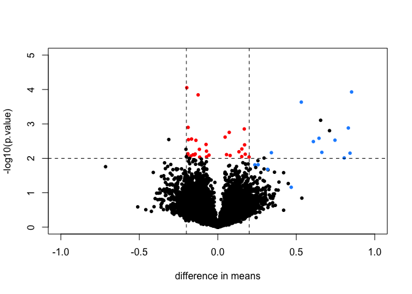
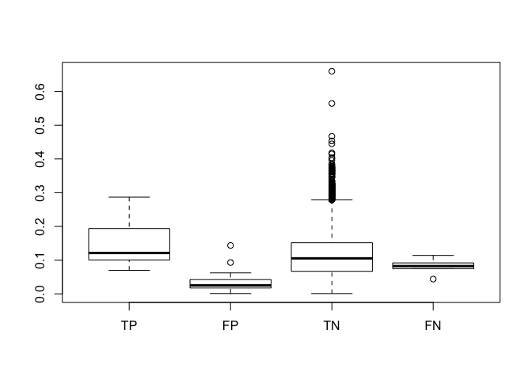
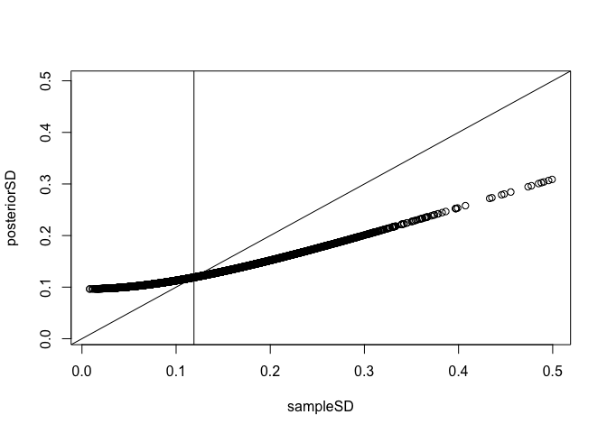
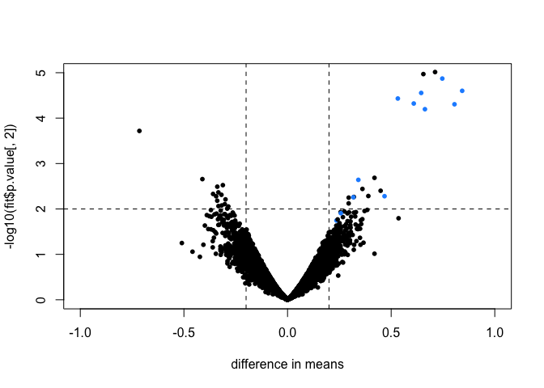

Hierarchical Models in Practice Exercises
================

``` r
## to install:
library(rafalib)
source("https://bioconductor.org/biocLite.R")
biocLite("SpikeInSubset")
library(Biobase)
library(SpikeInSubset)
data(rma95)
y <- exprs(rma95)
```

This dataset comes from an experiment in which RNA was obtained from the same background pool to create six replicate samples. Then RNA from 16 genes were artificially added in different quantities to each sample. These quantities (in picoMolars) and gene IDs are stored here:

``` r
pData(rma95)
```

    ##                  37777_at 684_at 1597_at 38734_at 39058_at 36311_at
    ## 1521a99hpp_av06      0.00   0.25     0.5        1        2        4
    ## 1532a99hpp_av04      0.00   0.25     0.5        1        2        4
    ## 2353a99hpp_av08      0.00   0.25     0.5        1        2        4
    ## 1521b99hpp_av06      0.25   0.50     1.0        2        4        8
    ## 1532b99hpp_av04      0.25   0.50     1.0        2        4        8
    ## 2353b99hpp_av08r     0.25   0.50     1.0        2        4        8
    ##                  36889_at 1024_at 36202_at 36085_at 40322_at 407_at
    ## 1521a99hpp_av06         8      16       32       64      128   0.00
    ## 1532a99hpp_av04         8      16       32       64      128   0.00
    ## 2353a99hpp_av08         8      16       32       64      128   0.00
    ## 1521b99hpp_av06        16      32       64      128      256   0.25
    ## 1532b99hpp_av04        16      32       64      128      256   0.25
    ## 2353b99hpp_av08r       16      32       64      128      256   0.25
    ##                  1091_at 1708_at 33818_at 546_at
    ## 1521a99hpp_av06      512    1024      256     32
    ## 1532a99hpp_av04      512    1024      256     32
    ## 2353a99hpp_av08      512    1024      256     32
    ## 1521b99hpp_av06     1024       0      512     64
    ## 1532b99hpp_av04     1024       0      512     64
    ## 2353b99hpp_av08r    1024       0      512     64

Note that these quantities were the same in the first three arrays and in the last three arrays. So we define two groups like this:

``` r
g <- factor(rep(0:1,each=3))
```

and create an index of which rows are associated with the artificially added genes:

``` r
spike <- rownames(y) %in% colnames(pData(rma95))
```

### Exercise 1

Note that only these 16 genes are differentially expressed since these six samples differ only due to random sampling (they all come from the same background pool of RNA).

Perform a t-test on each gene using the rowttests function in the genefilter package.

What proportion of genes with a p-value &lt; 0.01 (no multiple comparison correction) are not part of the artificially added (false positive)?

``` r
library(genefilter)
pvals <- rowttests(y,g)$p.value< 0.01
sum(pvals&!spike)/sum(pvals)
```

    ## [1] 0.7608696

``` r
mask <- with(rowttests(y,g), abs(dm) < .2 & p.value < .01)
cols <- ifelse(mask,"red",ifelse(spike,"dodgerblue","black"))
with(rowttests(y,g),plot(-dm, -log10(p.value), cex=.8, pch=16,
     xlim=c(-1,1), ylim=c(0,5),
     xlab="difference in means",
     col=cols))
abline(h=2,v=c(-.2,.2), lty=2)
```



### Exercise 2

Now compute the within group sample standard deviation for each gene (you can use group 1). Based on the p-value &lt; 0.01 cut-off, split the genes into true positives, false positives, true negatives and false negatives. Create a boxplot comparing the sample SDs for each group. Which of the following best described the box-plot?
The false positives have smaller standard deviation.

``` r
sds <- rowSds(y[,g==1])
index <- paste0(as.numeric(spike),as.numeric(pvals))
index <- factor(index,levels=c("11","01","00","10"),labels=c("TP","FP","TN","FN"))
boxplot(split(sds,index))
```



### Exercise 3

In the previous two questions we observed results consistent with the fact that the random variability associated with the sample standard deviation leads to t-statistics that are large by chance.

Note that the sample standard deviation we use in the t-test is an estimate and that with just a pair of triplicate samples, the variability associated with the denominator in the t-test can be large.

The following three steps perform the basic limma analysis. The eBayes step uses a hierarchical model that provides a new estimate of the gene specific standard error.

``` r
source("https://bioconductor.org/biocLite.R")
```

    ## Bioconductor version 3.6 (BiocInstaller 1.28.0), ?biocLite for help

    ## A new version of Bioconductor is available after installing the most
    ##   recent version of R; see http://bioconductor.org/install

``` r
biocLite("limma")
```

    ## BioC_mirror: https://bioconductor.org

    ## Using Bioconductor 3.6 (BiocInstaller 1.28.0), R 3.4.3 (2017-11-30).

    ## Installing package(s) 'limma'

    ## 
    ## The downloaded binary packages are in
    ##  /var/folders/ps/cc8h34252m5493xyx_tchmrm0000gn/T//RtmpeTxMNk/downloaded_packages

    ## Old packages: 'digest', 'qvalue', 'tinytex'

``` r
library(limma)
```

    ## 
    ## Attaching package: 'limma'

    ## The following object is masked from 'package:BiocGenerics':
    ## 
    ##     plotMA

``` r
fit <- lmFit(y, design=model.matrix(~ g))
colnames(coef(fit))
```

    ## [1] "(Intercept)" "g1"

``` r
fit <- eBayes(fit)
```

Make a plot of the original new hierarchical models based estimate versus the sample based estimate. Moves all the estimates of standard deviation closer to 0.12. correct

``` r
sampleSD <- fit$sigma
posteriorSD <- sqrt(fit$s2.post)
LIM <- range(c(posteriorSD,sampleSD))
plot(sampleSD,posteriorSD,ylim=LIM,xlim=LIM)
abline(0,1)
abline(v=sqrt(fit$s2.prior))
```



### Exercise 4

Use these new estimates (computed in Question 4.6.3) of standard deviation in the denominator of the t-test and compute p-values. You can do it like this: What proportion of genes with a p-value &lt; 0.01 (no multiple comparison correction) are not part of the artificially added (false positives)?

``` r
library(limma)
fit = lmFit(y, design=model.matrix(~ g))
fit = eBayes(fit)
##second coefficient relates to diffences between group
pvals = fit$p.value[,2] < 0.01
sum(pvals&!spike)/sum(pvals)
```

    ## [1] 0.6486486

``` r
mask <- abs(fit$coef[,2]) < .2 & fit$p.value[,2] < .01
cols <- ifelse(mask,"red",ifelse(spike,"dodgerblue","black"))
plot(fit$coef[,2], -log10(fit$p.value[,2]), cex=.8, pch=16,
     xlim=c(-1,1), ylim=c(0,5),
     xlab="difference in means",
     col=cols)
abline(h=2,v=c(-.2,.2), lty=2)
```


