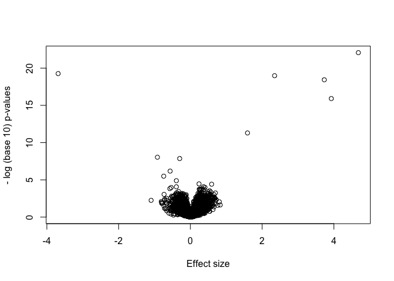
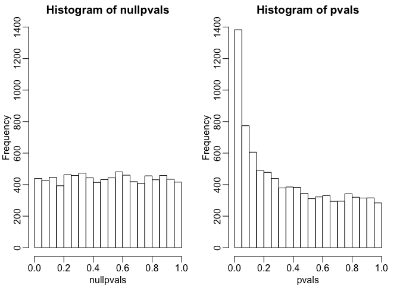
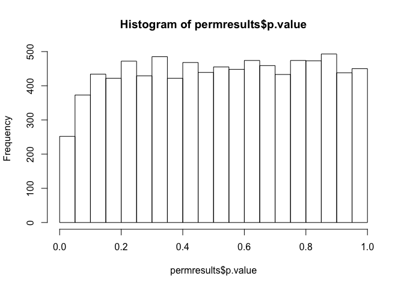
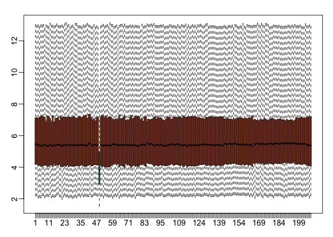
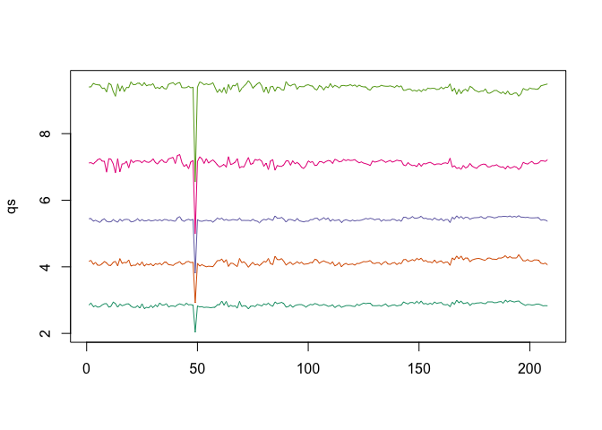
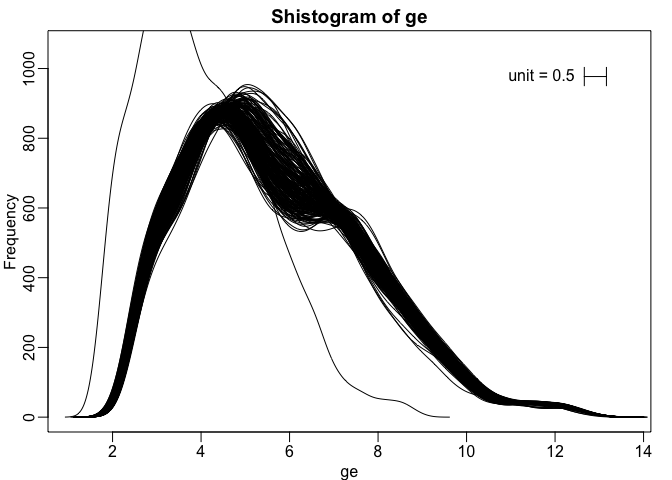
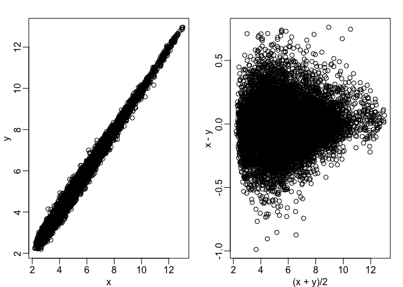

Plots
================

### Volcano plots

Some exploratory data analaysis techniques are particularly useful for high throughput data. Using a data set that has gene expression measurements for several thousand genes, we're going to perform a t-test on each one of these to show our first exploratory data analysis technique, which is the histogram of p-values. We're also going to generate (with a MC simulation), a case where we know for all genes, the null hypothesis is true.

``` r
library(genefilter)
library(GSE5859Subset)
data(GSE5859Subset)
g <- factor(sampleInfo$group)
results <- rowttests(geneExpression,factor(g))
pvals <- results$p.value

m <- nrow(geneExpression)
n <- ncol(geneExpression)
randomData <- matrix(rnorm(n*m),m,n)
nullpvals <- rowttests(randomData,g)$p.value
```

As we described earlier, reporting only p-values is a mistake when we can also report effect sizes. With high-throughput data, we can visualize the results by making a volcano plot. The idea behind a volcano plot is to show these for all features. In the y-axis we plot -log (base 10) p-values and on the x-axis we plot the effect size. By using -log (base 10), the "highly significant" features appear at the top of the plot. Using log also permits us to better distinguish between small and very small p-values, for example 0.01 and 10<sup>6</sup>. Here is the volcano plot for our results above:

``` r
plot(results$dm,-log10(results$p.value),
     xlab="Effect size",ylab="- log (base 10) p-values")
```

 Many features with very small p-values, but small effect sizes as we see here, are sometimes indicative of problematic data.

### p-Value Histograms

Another plot we can create to get an overall idea of the results is to make histograms of p-values. When we generate completely null data the histogram follows a uniform distribution. With our original dataset we see a higher frequency of smaller p-values.

``` r
library(rafalib)
mypar(1,2)
hist(nullpvals,ylim=c(0,1400))
hist(pvals,ylim=c(0,1400))
```

 When we expect most hypotheses to be null and don't see a uniform p-value distribution, it might be indicative of unexpected properties, such as correlated samples.

If we permute the outcomes and calculate p-values then, if the samples are independent, we should see a uniform distribution. With these data we do not:

``` r
permg <- sample(g)
permresults <- rowttests(geneExpression,permg)
hist(permresults$p.value)
```

 In a later chapter we will see that the columns in this dataset are not independent and thus the assumptions used to compute the p-values here are incorrect.

### Data boxplots and histograms

With high-throughput data, we have thousands of measurements for each experimental unit. As mentioned earlier, this can help us detect quality issues. For example, if one sample has a completely different distribution than the rest, we might suspect there are problems. Although a complete change in distribution could be due to real biological differences, more often than not it is due to a technical problem. Here we load a large gene expression experiment available from Bioconductor. We "accidentally" use log instead of log2 on one of the samples.

``` r
library(Biobase)
```

    ## Loading required package: BiocGenerics

    ## Loading required package: parallel

    ## 
    ## Attaching package: 'BiocGenerics'

    ## The following objects are masked from 'package:parallel':
    ## 
    ##     clusterApply, clusterApplyLB, clusterCall, clusterEvalQ,
    ##     clusterExport, clusterMap, parApply, parCapply, parLapply,
    ##     parLapplyLB, parRapply, parSapply, parSapplyLB

    ## The following objects are masked from 'package:stats':
    ## 
    ##     IQR, mad, sd, var, xtabs

    ## The following objects are masked from 'package:base':
    ## 
    ##     anyDuplicated, append, as.data.frame, cbind, colMeans,
    ##     colnames, colSums, do.call, duplicated, eval, evalq, Filter,
    ##     Find, get, grep, grepl, intersect, is.unsorted, lapply,
    ##     lengths, Map, mapply, match, mget, order, paste, pmax,
    ##     pmax.int, pmin, pmin.int, Position, rank, rbind, Reduce,
    ##     rowMeans, rownames, rowSums, sapply, setdiff, sort, table,
    ##     tapply, union, unique, unsplit, which, which.max, which.min

    ## Welcome to Bioconductor
    ## 
    ##     Vignettes contain introductory material; view with
    ##     'browseVignettes()'. To cite Bioconductor, see
    ##     'citation("Biobase")', and for packages 'citation("pkgname")'.

``` r
library(GSE5859) 
data(GSE5859) 
ge <- exprs(e) ##ge for gene expression
ge[,49] <- ge[,49]/log2(exp(1)) ##imitate error
```

A quick look at a summary of the distribution using boxplots immediately highlights the mistake:

``` r
library(rafalib)
mypar(1,1)
boxplot(ge,range=0,names=1:ncol(e),col=ifelse(1:ncol(ge)==49,1,2))  
```

 Note that the number of samples is a bit too large here, making it hard to see the boxes. One can instead simply show the boxplot summaries without the boxes:

``` r
qs <- t(apply(ge,2,quantile,prob=c(0.05,0.25,0.5,0.75,0.95)))
matplot(qs,type="l",lty=1)
```

 We refer to this figure as a kaboxplot because Karl Broman was the first we saw use it as an alternative to boxplots.

We can also plot all the histograms. Because we have so much data, we create histograms using small bins, then smooth the heights of the bars and then plot smooth histograms. We re-calibrate the height of these smooth curves so that if a bar is made with base of size "unit" and height given by the curve at *x*<sub>0</sub>, the area approximates the number of points in region of size "unit" centered at *x*<sub>0</sub>:

``` r
mypar(1,1)
shist(ge,unit=0.5)
```



### MA plot

Scatterplots and correlation are not the best tools to detect replication problems. A better measure of replication can be obtained from examining the differences between the values that should be the same. Therefore, a better plot is a rotation of the scatterplot containing the differences on the y-axis and the averages on the x-axis. This plot was originally named a Bland-Altman plot, but in genomics it is commonly referred to as an MA-plot. The name MA comes from plots of red log intensity minus (M) green intensities versus average (A) log intensities used with microarrays (MA) data.

``` r
x <- ge[,1]
y <- ge[,2]
mypar(1,2)
plot(x,y)
plot((x+y)/2,x-y)
```

 Note that once we rotate the plot, the fact that these data have differences of about:

``` r
sd(y-x)
```

    ## [1] 0.2025465

Becomes immediate. The scatterplot shows very strong correlation, which is not necessarily informative here.

We will later introduce dendograms, heatmaps, and multi-dimensional scaling plots.
