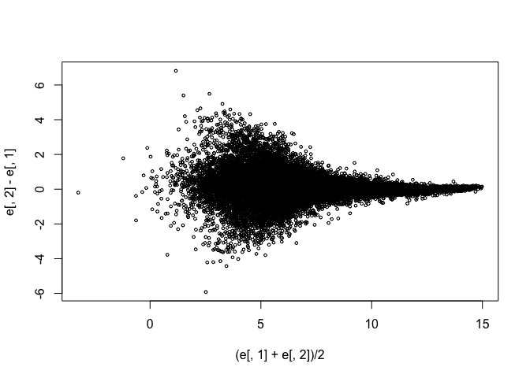

Plots Exercises
================

### Exercise 1

Download and install the Bioconductor package SpikeInSubset and then load the library and the mas133 data

``` r
source("http://www.bioconductor.org/biocLite.R")
```

    ## Bioconductor version 3.6 (BiocInstaller 1.28.0), ?biocLite for help

    ## A new version of Bioconductor is available after installing the most
    ##   recent version of R; see http://bioconductor.org/install

``` r
biocLite("SpikeInSubset")
```

    ## BioC_mirror: https://bioconductor.org

    ## Using Bioconductor 3.6 (BiocInstaller 1.28.0), R 3.4.3 (2017-11-30).

    ## Installing package(s) 'SpikeInSubset'

    ## installing the source package 'SpikeInSubset'

    ## Old packages: 'digest', 'qvalue', 'tinytex', 'xtable'

``` r
library(SpikeInSubset)
```

    ## Loading required package: Biobase

    ## Loading required package: BiocGenerics

    ## Loading required package: parallel

    ## 
    ## Attaching package: 'BiocGenerics'

    ## The following objects are masked from 'package:parallel':
    ## 
    ##     clusterApply, clusterApplyLB, clusterCall, clusterEvalQ,
    ##     clusterExport, clusterMap, parApply, parCapply, parLapply,
    ##     parLapplyLB, parRapply, parSapply, parSapplyLB

    ## The following objects are masked from 'package:stats':
    ## 
    ##     IQR, mad, sd, var, xtabs

    ## The following objects are masked from 'package:base':
    ## 
    ##     anyDuplicated, append, as.data.frame, cbind, colMeans,
    ##     colnames, colSums, do.call, duplicated, eval, evalq, Filter,
    ##     Find, get, grep, grepl, intersect, is.unsorted, lapply,
    ##     lengths, Map, mapply, match, mget, order, paste, pmax,
    ##     pmax.int, pmin, pmin.int, Position, rank, rbind, Reduce,
    ##     rowMeans, rownames, rowSums, sapply, setdiff, sort, table,
    ##     tapply, union, unique, unsplit, which, which.max, which.min

    ## Welcome to Bioconductor
    ## 
    ##     Vignettes contain introductory material; view with
    ##     'browseVignettes()'. To cite Bioconductor, see
    ##     'citation("Biobase")', and for packages 'citation("pkgname")'.

    ## Loading required package: affy

``` r
data(mas133)
```

Now make the following plot of the first two samples and compute the correlation:

``` r
e <- exprs(mas133)
plot(e[,1],e[,2],main=paste0("corr=",signif(cor(e[,1],e[,2]),3)),cex=0.5)
k <- 3000
b <- 1000 #a buffer
polygon(c(-b,k,k,-b),c(-b,-b,k,k),col="red",density=0,border="red")
```

 What proportion of the points are inside the box?

``` r
mean(e[,1]<3000 & e[,2]<3000)
```

    ## [1] 0.9475336

### Exercise 2

``` r
plot(log2(e[,1]),log2(e[,2]),main=paste0("corr=",signif(cor(log2(e[,1]),log2(e[,2])),2)),cex=0.5)
k <- log2(3000)
b <- log2(0.5)
polygon(c(b,k,k,b),c(b,b,k,k),col="red",density=0,border="red")
```

 What is an advantage of taking the log?
The tails do not dominate the plots.

### Exercise 3

``` r
e <- log2(exprs(mas133))
plot((e[,1]+e[,2])/2,e[,2]-e[,1],cex=0.5)
```

 The two samples we are plotting are replicates (they random samples fro the same batch of RNA) The correlation of the data was 0.997 in the original scale, 0.96 in the log-scale. High correlations are sometimes confused for evidence of replication. But replication implies we get very small difference between the observations which is better measured with distance or differences.

What is the standard deviation of the log ratios for this comparison?

``` r
sd(e[,2]-e[,1])
```

    ## [1] 0.7767887

### Exercise 4

How many fold changes above 2 do we see? Note that these measures of log (base 2) of expression so a fold change of 2 translates into a difference, in absolute value, of 1.

``` r
sum(abs(e[,2]-e[,1])>1)
```

    ## [1] 3057
