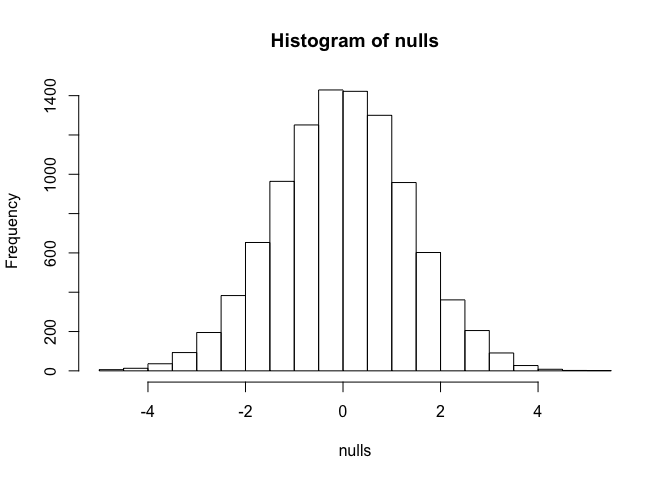
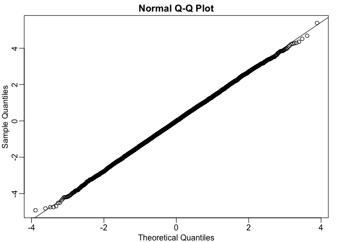
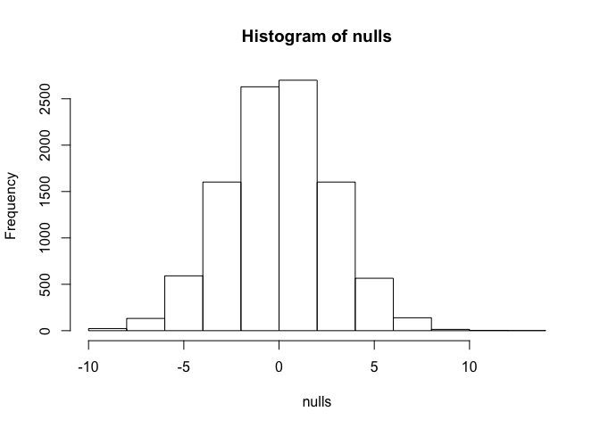
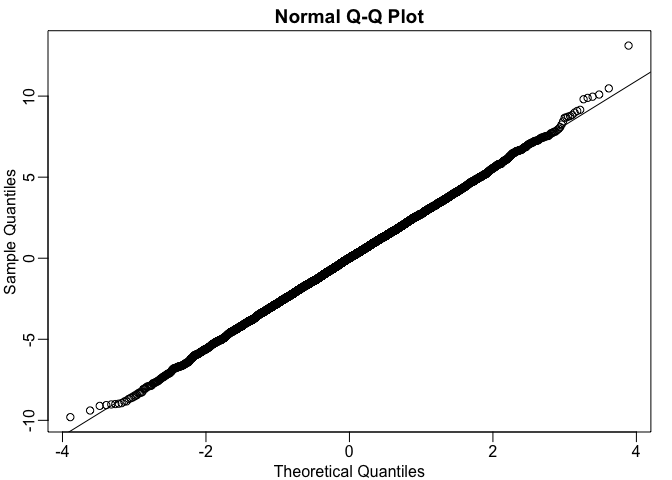

CLT in practice
================

Previously, we ran some code that created a null distribution by sampling from the original population data.

``` r
library(dplyr)
```

``` r
dat <- read.csv("femaleMiceWeights.csv")

control <- filter(dat, Diet=="chow") %>%
  select(Bodyweight) %>% unlist

treatment <- filter(dat, Diet=="hf") %>%
  select(Bodyweight) %>% unlist

obs <- mean(treatment) - mean(control)

population <- read.csv("femaleControlsPopulation.csv")
population <- unlist(population)

n <- 10000
nulls <- vector("numeric",n)
for(i in 1:n){
  control <- sample(population, 12)
  treatment <- sample(population, 12)
  nulls[i] <- mean(treatment) - mean(control)
}
hist(nulls)
```



What we created in "nulls" is the null distribution of a random variable, the difference in means under the null hypothesis (food has no effect on weight- only controls used). We want to see now that the normal approximation applies here. In this case, for the CLT, n = 12. The histogram already shows that it looks like a normal distribution, but to be sure, we are going to use the qq Norm function which makes a qq plot comparing the observed data to the theoretical normal distribution.

``` r
library(rafalib)
mypar()

qqnorm(nulls)
qqline(nulls)
```

 The qqline function adds a line, which goes right through the data. This demonstrates that this difference in average is in fact following a normal distribution. Now we can try the same with a smaller number. CLT may not necessarily work as 3 is a very small number - it has to be *very* large for it to be a perfect approximation.

``` r
n <- 10000
nulls <- vector("numeric",n)
for(i in 1:n){
  control <- sample(population, 3)
  treatment <- sample(population, 3)
  nulls[i] <- mean(treatment) - mean(control)
}
hist(nulls)
```

 If we make the same qqplot we can see that the normal approximation becomes slightly worse - the tails are a little bit bigger than what we had before.

``` r
mypar()

qqnorm(nulls)
qqline(nulls)
```

 Now we know how good the normal approxmation can be, we can start thinking of ways of using it when we don't have access to the population data. We instead use the normal approxmation, and say the null distribution is normally distributed, has this mean, this variance, and now we can compute p values without even having access to the population data. In practice, this is how CLT is used. We obtain p values to get confidence intervals, and to perform statistical inference in general.
