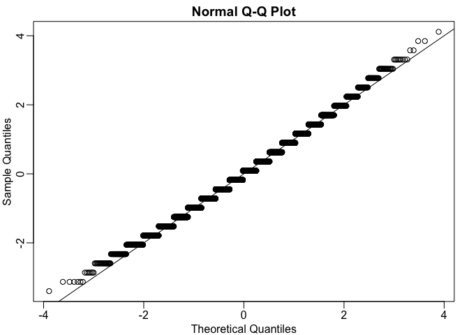
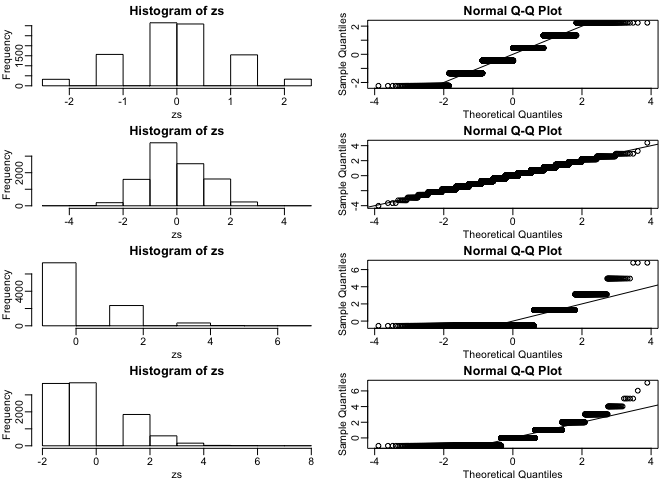

CLT and t-distribution exercises
================

``` r
library(downloader)
library(rafalib)
library(dplyr)
```

    ## Warning: package 'dplyr' was built under R version 3.4.4

    ## 
    ## Attaching package: 'dplyr'

    ## The following objects are masked from 'package:stats':
    ## 
    ##     filter, lag

    ## The following objects are masked from 'package:base':
    ## 
    ##     intersect, setdiff, setequal, union

``` r
url <- "https://raw.githubusercontent.com/genomicsclass/dagdata/master/inst/extdata/femaleMiceWeights.csv"
filename <- "femaleMiceWeights.csv"
if(!file.exists("femaleMiceWeights.csv")) download(url,destfile=filename)
dat <- read.csv(filename)
```

1.  The CLT is a result from probability theory. Much of probability theory was originally inspired by gambling. This theory is still used in practice by casinos. For example, they can estimate how many people need to play slots for there to be a 99.9999% probability of earning enough money to cover expenses. Let's try a simple example related to gambling.
    Suppose we are interested in the proportion of times we see a 6 when rolling n=100 die. This is a random variable which we can simulate with x=sample(1:6, n, replace=TRUE) and the proportion we are interested in can be expressed as an average: mean(x==6). Because the die rolls are independent, the CLT applies.

``` r
n=100
x <- sample(1:6, n, replace=TRUE)
mean(x==6)
```

    ## [1] 0.15

We want to roll n dice 10,000 times and keep these proportions. This random variable (proportion of 6s) has mean p=1/6 and variance p(1-p)/n. So according to CLT z = (mean(x==6) - p) / sqrt(p(1-p)/n) should be normal with mean 0 and SD 1. Set the seed to 1, then use replicate to perform the simulation, and report what proportion of times z was larger than 2 in absolute value (CLT says it should be about 0.05).

``` r
set.seed(1)
n <- 100
p <- 1/6
variance <- (p*(1-p))/n
z <- replicate(10000,{
  x <- sample(1:6,n,replace=TRUE)
  (mean(x==6) - p) / sqrt(variance)
}) 

mypar()
qqnorm(z)
abline(0,1)
```

 Shows it can be approximated w normal distribution

``` r
mean(abs(z) > 2)
```

    ## [1] 0.0424

1.  For the last simulation you can make a qqplot to confirm the normal approximation. Now, the CLT is an asympototic result, meaning it is closer and closer to being a perfect approximation as the sample size increases. In practice, however, we need to decide if it is appropriate for actual sample sizes. Is 10 enough? 15? 30?

In the example used in exercise 1, the original data is binary (either 6 or not). In this case, the success probability also affects the appropriateness of the CLT. With very low probabilities, we need larger sample sizes for the CLT to "kick in".

Run the simulation from exercise 1, but for different values of p and n. For which of the following is the normal approximation best?

``` r
ps <- c(0.5,0.5,0.01,0.01)
ns <- c(5,30,30,100)
library(rafalib)
mypar(4,2)
for(i in 1:4){
  p <- ps[i]
  sides <- 1/p
  n <- ns[i]
  zs <- replicate(10000,{
    x <- sample(1:sides,n,replace=TRUE)
    (mean(x==1) - p) / sqrt(p*(1-p)/n)
  }) 
  hist(zs,nclass=7)
  qqnorm(zs)
  abline(0,1)
}
```

 The best is p = 0.05, n = 30.

1.  As we have already seen, the CLT also applies to averages of quantitative data. A major difference with binary data, for which we know the variance is , is that with quantitative data we need to estimate the population standard deviation.

In several previous exercises we have illustrated statistical concepts with the unrealistic situation of having access to the entire population. In practice, we do *not* have access to entire populations. Instead, we obtain one random sample and need to reach conclusions analyzing that data. dat is an example of a typical simple dataset representing just one sample. We have 12 measurements for each of two populations:

``` r
X <- filter(dat, Diet=="chow") %>% select(Bodyweight) %>% unlist
```

    ## Warning: package 'bindrcpp' was built under R version 3.4.4

``` r
Y <- filter(dat, Diet=="hf") %>% select(Bodyweight) %>% unlist
```

We think of X as a random sample from the population of all mice in the control diet and Y as a random sample from the population of all mice in the high fat diet. Define the parameter mu\_x as the average of the control population. We estimate this parameter with the sample average Xbar. What is the sample average?

``` r
mean(X)
```

    ## [1] 23.81333

1.  We don't know mu\_x, but we want to use Xbar to understand mu\_x. Using CLT: Xbar follows a normal distribution with mean mu\_x and standard deviation sigma\_x/sqrt(12) where sigma\_x is the population standard deviation.

2.  So the distribution of the random variable Z = sqrt(12) \* ((Xbar-mu\_x)/(sigma\_x)). What does the CLT tell us is the mean of Z? 0

3.  The results of 4 and 5 tell us that we know the distribution of the difference between our estimate and what we want to estimate, but don't know. However, the equation involves the population standard deviation sigma\_x , which we don't know. Given what we discussed, what is your estimate of sigma\_x?

``` r
sd(X)
```

    ## [1] 3.022541

1.  Use the CLT to approximate the probability that our estimate Xbar is off by more than 2g from mu\_x

``` r
2 * (1-pnorm(2/sd(X) * sqrt(12)))
```

    ## [1] 0.02189533

1.  What is the estimate of SE(Xbar - Ybar)

``` r
sigmaX = sd(X)
sigmaY = sd(Y)
se <- sqrt((sigmaY^2)/12+(sigmaX^2)/12)
se
```

    ## [1] 1.469867

1.  Compute Ybar - Xbar as well as an estimate of this standard error and construct a t-statistic.

``` r
YbarMinusXbar = mean(Y) - mean(X)
tstat <- YbarMinusXbar/se
tstat
```

    ## [1] 2.055174

1.  If we apply the CLT, what is the distribution of this t-statistic Normal w/ mean0 and sd 1

2.  Now we are ready to compute a p-value using the CLT. What is the probability of observing a quantity as large as what we computed in 9, when the null distribution is true?

``` r
2 * (1-pnorm(tstat))
```

    ## [1] 0.0398622

1.  CLT provides an approximation for cases in which the sample size is large. In practice, we can't check the assumption because we only get to see 1 outcome (which you computed above). As a result, if this approximation is off, so is our p-value. As described earlier, there is another approach that does not require a large sample size, but rather that the distribution of the population is approximately normal. We don't get to see this distribution so it is again an assumption, although we can look at the distribution of the sample with qqnorm(X) and qqnorm(Y). If we are willing to assume this, then it follows that the t-statistic follows t-distribution. What is the p-value under the t-distribution approximation? Hint: use the t.test function.

``` r
t.test(X,Y)$p.value
```

    ## [1] 0.05299888

1.  With the CLT distribution, we obtained a p-value smaller than 0.05 and with the t-distribution, one that is larger. They can't both be right. What best describes the difference? These are two different assumptions. The t-distribution accounts for the variability introduced by the estimation of the standard error and thus, under the null, large values are more probable under the null distribution.
