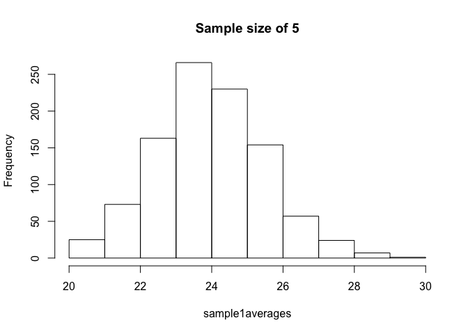
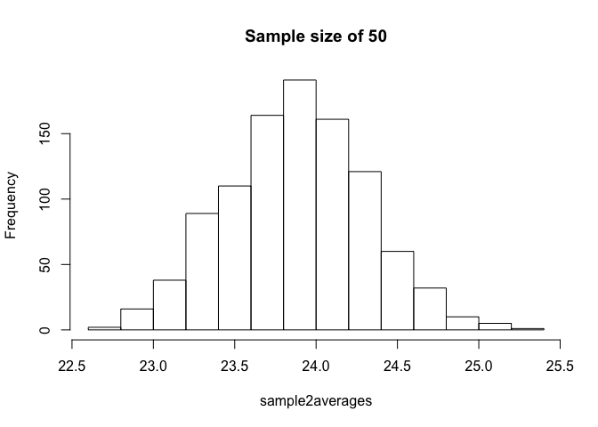

Normal distribution exercises
================

``` r
miceweights <- unlist(read.csv("femaleControlsPopulation.csv"))
```

Using the same process as before (in Null Distribution Exercises), set the seed at 1, then using a for-loop take a random sample of 5 mice 1,000 times. Save these averages. After that, set the seed at 1, then using a for-loop take a random sample of 50 mice 1,000 times. Save these averages.

``` r
set.seed(1); 
n <- 1000
sample1averages <- vector("numeric",n)
for(i in 1:n){
  sample1averages[i] <- mean(sample(miceweights, size=5))
}

set.seed(1); 
n <- 1000
sample2averages <- vector("numeric",n)
for(i in 1:n){
  sample2averages[i] <- mean(sample(miceweights, size=50))
}
```

1.  Use a histogram to "look" at the distribution of averages we get with a sample size of 5 and a sample size of 50. How would you say they differ? They both look roughly normal, but with a sample size of 50 the spread is smaller.

``` r
hist(sample1averages, main="Sample size of 5")
```



``` r
hist(sample2averages, main="Sample size of 50")
```



1.  For the last set of averages, the ones obtained from a sample size of 50, what proportion are between 23 and 25?

``` r
mean(sample2averages <= 25) - mean(sample2averages <= 23)
```

    ## [1] 0.976

1.  Now ask the same question of a normal distribution with average 23.9 and standard deviation 0.43.

``` r
pnorm(25,23.9,0.43) - pnorm(23,23.9,0.43)
```

    ## [1] 0.9765648
