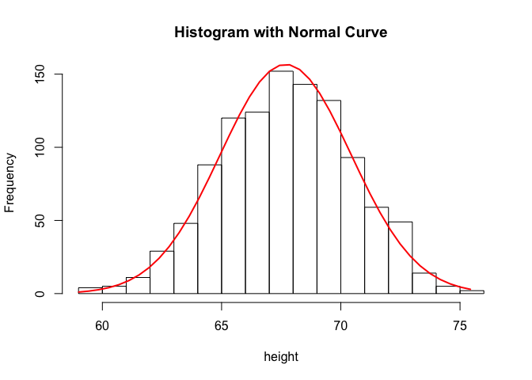
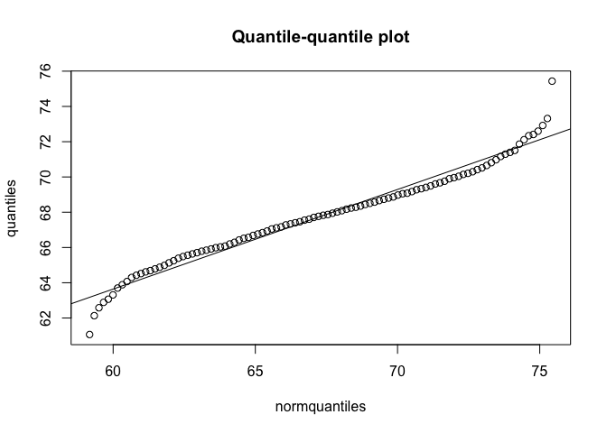
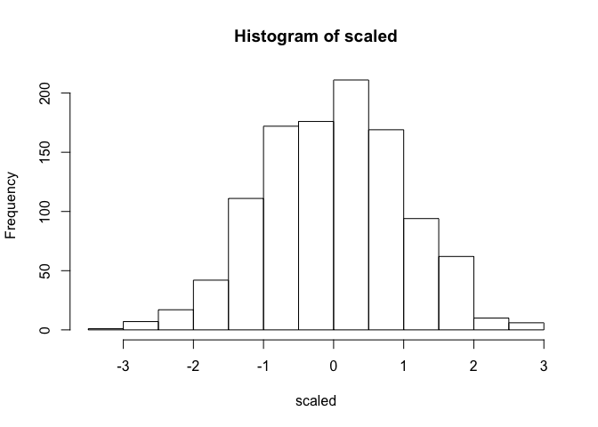

Normal Distribution Info
================

``` r
library(UsingR)
x <- father.son$fheight
```

### Information

The normal approximation is also called the bell curve or Gaussian distribution.
$$ \\mbox{Pr}(a &lt; x &lt; b) = \\int\_a^b \\frac{1}{\\sqrt{2\\pi\\sigma^2}} \\exp{\\left( \\frac{-(x-\\mu)^2}{2 \\sigma^2} \\right)} , dx $$
 It tells us that the proportion of numbers between a and b is given by the integral on the right. The two important numbers are mu and sigma, or the mean and standard deviation. If a list of numbers follows a normal distribution, and we know mu and sigma, then we know everything there is to know about the distribution. We can answer the question "What is the proportion of x's that are between any a and any b?"
So if the distribution of data is approximated by a normal distribution, then you know for any interval, what proportion of the data is in that interval. E.g. you're going to know that 95% of your data is within two standard deviations of the average, 99% is within 2.5 standard deviations of the average, and 68% are within one standard deviation of the average.
So lets use our example. With height, we can compute the mean

``` r
mean(x)
```

    ## [1] 67.6871

We can also compute the standard deviation

``` r
sd(x)
```

    ## [1] 2.744868

And as we will see soon, the data distribution is approximately normal. So if we need to know the proportion of adults between 65 and 71 inches, we don't have to count because we know its approximated by a normal distribution. We also know that this interval is one standard deviation from the average, so 68% will be close to the right answer. The equation for standard deviation is given below:

$$\\sigma = \\sqrt{\\frac{1}{M} \\sum\_{i=1}^M (x\_i - \\overline{x})^2}.$$
 The standard deviation is like an average distance from the mean. Variance is standard deviation squared.
So let us look at the distribution of heights with a histogram, and a normal distribution with mean and standard deviation obtained from the data. It is a good approximation.

``` r
plot.new()
h <- hist(x, xlab='height', main="Histogram with Normal Curve")
xfit <- seq(min(x),max(x),length=40)
yfit <- dnorm(xfit,mean=mean(x),sd=sd(x))
yfit <- yfit*diff(h$mids[1:2])*length(x)
lines(xfit,yfit,col="red",lwd=2)
```

 To look at the data more rigorously, we can look at a quantile-quantile plot. We compute, for example, for percentile (1%, 2%, 3% etc) the number for which 1% of the data is below that number. We compute the *percentiles* for the data set. We can then create a quantile-quantile plot, where we plot the percentiles for the normal distribution and for the data.

``` r
percentiles <- seq(.01,1,.01)
quantiles <- quantile(x,percentiles)
normquantiles <-quantile(xfit,percentiles)
plot(normquantiles,quantiles, main='Quantile-quantile plot')
abline(lm(quantiles ~ normquantiles))
```

 If the two have the same distribution, then the graph points should fall on the identity line (which they almost do), so this tells us the normal distribution is a good approximation.

### Standardised units

If you know your data is approximately normal, you can convert it to what are called 'standard units' (Z) by subtracting the mean, and dividing it by the standard deviation for each point in your distribution. Those are now going to have normal distribution with mean and standard deviation 1. When you say you have a Z-score of 2, you know you are quite tall as that is 2 standard deviations away from the mean. We do not have to think about units.

``` r
scaled <- scale(x)
hist(scaled)
```

 \#\#\#Summary If the data is approximated by the normal distribution, then all thats needed to know about the data is the mean and standard deviation - those are considered a summary of the data. With these two numbers, you can describe the proportion of any interval. This only works if the data is normally distributed.
