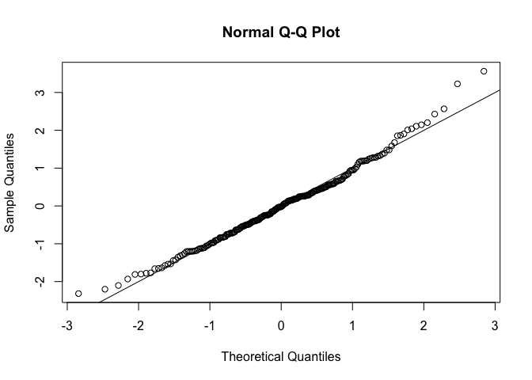
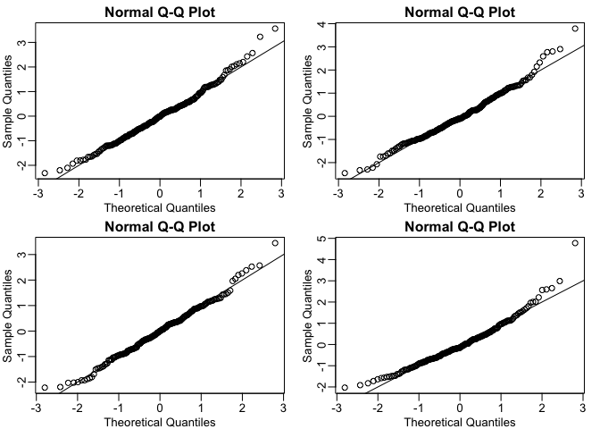
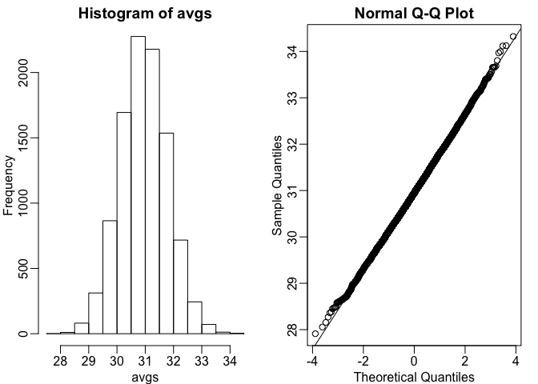

CLT questions
================

``` r
library(downloader) 
url <- "https://raw.githubusercontent.com/genomicsclass/dagdata/master/inst/extdata/mice_pheno.csv"
filename <- basename(url)
download(url, destfile=filename)
dat <- na.omit( read.csv(filename) )
```

1.  If a list of numbers has a distribution that is well approximated by the normal distribution, what proportion of these numbers are within one standard deviation away from the list's average?

``` r
pnorm(1)-pnorm(-1)
```

    ## [1] 0.6826895

If a data distribution is approximately normal, then around 68% of the data values are within one standard deviation of the mean.

1.  What proportion of these numbers are within two standard deviations away from the list's average? 95%

``` r
pnorm(2)-pnorm(-2)
```

    ## [1] 0.9544997

1.  Three standard deviations?

``` r
pnorm(3)-pnorm(-3)
```

    ## [1] 0.9973002

99.7%

1.  Define y to be the weights of males on the control diet. What proportion of the mice are within one standard deviation away from the average weight?

``` r
y <- filter(dat, Sex == "M" & Diet == "chow") %>% 
      select(Bodyweight) %>% unlist
```

    ## Warning: package 'bindrcpp' was built under R version 3.4.4

``` r
mean(y>=(mean(y)-popsd(y))) - mean(y>=(mean(y)+popsd(y))) 
```

    ## [1] 0.6950673

1.  What proportion is within two standard deviations away?

``` r
mean(y>=(mean(y)-(popsd(y)*2))) - mean(y>=(mean(y)+(popsd(y)*2)))
```

    ## [1] 0.9461883

1.  Three?

``` r
mean(y>=(mean(y)-(popsd(y)*3))) - mean(y>=(mean(y)+(popsd(y)*3)))
```

    ## [1] 0.9910314

1.  Note that the numbers for the normal distribution and our weights are relatively close. Also, notice that we are indirectly comparing quantiles of the normal distribution to quantiles of the mouse weight distribution. We can actually compare all quantiles using a qqplot. Which of the following best describes the qq-plot comparing mouse weights to the normal distribution?

``` r
z <- ( y - mean(y) ) / popsd(y)
qqnorm(z)
abline(0,1)
```

 The mouse weights are well approximated by the normal distribution, although the larger values (right tail) are larger than predicted by the normal. This is consistent with the differences seen between question 3 and 6.

1.  Create the above qq-plot for the four populations: male/females on each of the two diets. What is the most likely explanation for the mouse weights being well approximated? What is the best explanation for all these being well approximated by the normal distribution?

``` r
mypar(2,2)
y <- filter(dat, Sex=="M" & Diet=="chow") %>% select(Bodyweight) %>% unlist
z <- ( y - mean(y) ) / popsd(y)
qqnorm(z);abline(0,1)
y <- filter(dat, Sex=="F" & Diet=="chow") %>% select(Bodyweight) %>% unlist
z <- ( y - mean(y) ) / popsd(y)
qqnorm(z);abline(0,1)
y <- filter(dat, Sex=="M" & Diet=="hf") %>% select(Bodyweight) %>% unlist
z <- ( y - mean(y) ) / popsd(y)
qqnorm(z);abline(0,1)
y <- filter(dat, Sex=="F" & Diet=="hf") %>% select(Bodyweight) %>% unlist
z <- ( y - mean(y) ) / popsd(y)
qqnorm(z);abline(0,1)
```

 This just happens to be how nature behaves in this particular case. Perhaps the result of many biological factors averaging out

1.  Here we are going to use the function replicate to learn about the distribution of random variables. All the above exercises relate to the normal distribution as an approximation of the distribution of a fixed list of numbers or a population. We have not yet discussed probability in these exercises. If the distribution of a list of numbers is approximately normal, then if we pick a number at random from this distribution, it will follow a normal distribution. However, it is important to remember that stating that some quantity has a distribution does not necessarily imply this quantity is random. Also, keep in mind that this is not related to the central limit theorem. The central limit applies to averages of random variables. Let's explore this concept.

We will now take a sample of size 25 from the population of males on the chow diet. The average of this sample is our random variable. We will use the replicate to observe 10,000 realizations of this random variable. Set the seed at 1, generate these 10,000 averages. Make a histogram and qq-plot of these 10,000 numbers against the normal distribution.

We can see that, as predicted by the CLT, the distribution of the random variable is very well approximated by the normal distribution. What is the average of the distribution of the sample average?

``` r
set.seed(1)
y <- filter(dat, Sex=="M" & Diet=="chow") %>% select(Bodyweight) %>% unlist
avgs <- replicate(10000, mean( sample(y,25)))
mypar(1,2)
hist(avgs)
qqnorm(avgs)
qqline(avgs)
```



``` r
mean(avgs)
```

    ## [1] 30.95581

1.  What is the standard deviation of the distribution of sample averages?

``` r
popsd(avgs)
```

    ## [1] 0.8368192
