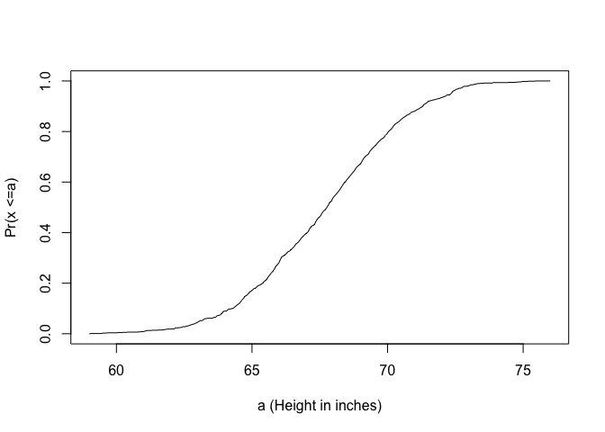
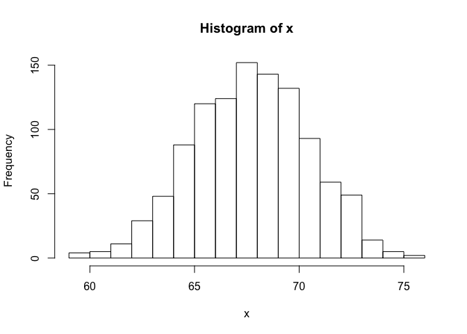
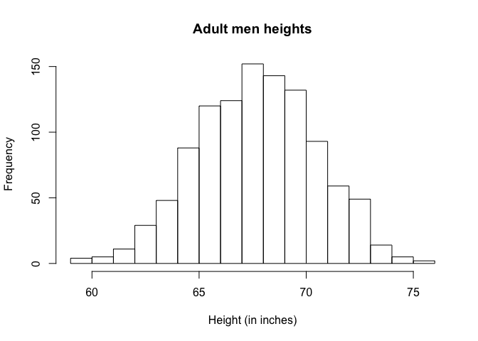
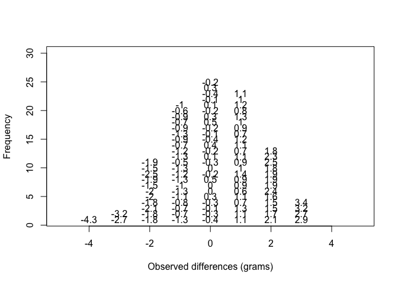
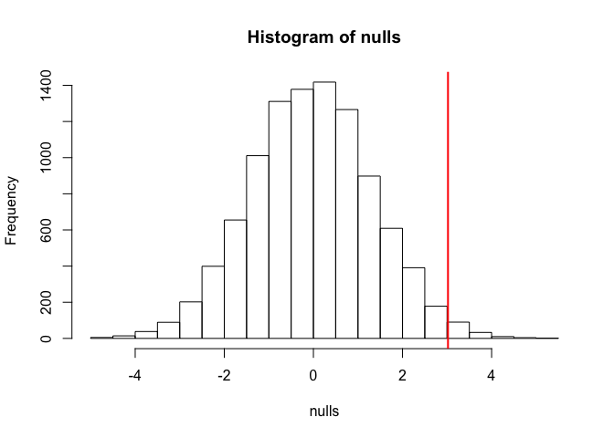

Probability Distributions
================

### loading previous data

#### note that MASS included in the UsingR library masks the dplyr select function

``` r
library(dplyr)
dat <- read.csv("femaleMiceWeights.csv")
control <- filter(dat, Diet=="chow") %>% select(Bodyweight) %>% unlist
treatment <- filter(dat, Diet=="hf") %>% select(Bodyweight) %>% unlist
obs <- mean(treatment) - mean(control)

population <- read.csv("femaleControlsPopulation.csv")
population <- unlist(population)

n <- 10000
nulls <- vector("numeric",n)
for(i in 1:n){
  control <- sample(population, 12)
  treatment <- sample(population, 12)
  nulls[i] <- mean(treatment) - mean(control)
}
```

Distributions
-------------

A distribution is a compact description of many numbers. E.g. suppose you have measured the heights of all men in a population, and you need to describe the numbers to someone who has no idea what the data is. One example is to list them out - here are 10 randomly selected heights out of 1078.

``` r
library(UsingR)
x <- father.son$fheight
round(sample(x,10),1)
```

    ##  [1] 63.6 72.3 69.2 65.6 69.1 71.7 65.7 66.1 70.3 69.3

### Cumulative Distribution Function

Looking at the numbers we can get a rough idea of what the list looks like. To improve on this approach we can define and visualise a *distribution*. To define a distribution we compute, for all possible values of *a*, the proportion of numbers in our list that are below *a*.
*F*(*a*)≡Pr(*x* ≤ *a*)
 Called the cumulative distribution function (CDF). When the CDF is derived from data (as opposed to theoretically) we call it the empirical CDF (ECDF). The ECDF for the height data is:

``` r
smallest <- floor (min(x))
largest <- ceiling(max(x))
values <- seq(smallest, largest, len=300)
heightecdf <- ecdf(x)
plot(values, heightecdf(values), type="l",
     xlab="a (Height in inches)", ylab="Pr(x <=a)")
```



### Histograms

The ecdf function is a function that returns a function. Histograms give us the same information, but show us the proportion of values in intervals so the results are easier to interpret:
Pr(*a* ≤ *x* ≤ *b*)=*F*(*b*)−*F*(*a*)
 Plotting the heights as bars is called a *histogram*. It is more useful as we are usually more interested in intervals rather than the percent less than a particular height. It is also easier to distinguish between different types (families) of distributions by looking at histograms.

``` r
hist(x)
```

 We can also specify bins and add better labels

``` r
bins <- seq(smallest,largest)
hist(x, breaks=bins, xlab="Height (in inches)", main="Adult men heights")
```

 Simple but informative plot can approximate number of individuals in any given interval. E.g. about 70 individuals over 72 inches tall.

### Probability Distribution

Another use of distributions is to describe the possible outcomes of a random variable. Unlike a fixed list of numbers, we don't observe all possible outcomes of random variables, so we describe probabilities instead of proportions. For example, if we pick a random height from our list, the probability of it falling between *a* and *b* is:
Pr(*a* ≤ *X* ≤ *b*)=*F*(*b*)−*F*(*a*)
 Now x is capitalised ot X to distinguish it as a random variable. This distribution is very useful. For example if we know the distribution of the difference in mean of mouse weights when the null hypothesis is true (null distribution), we can compute the probability of observing a value as large as we did (p-value). Previously we ran a Monte Carlo simulation of 10,000 outcomes of the random variable under the null hypothesis. Now we repeat this but add a point to the figure every time we re-run the experimet. The null distribution forms as the observed values stack on top of each other.

``` r
n <- 100
library(rafalib)
nullplot(-5,5,1,30, xlab="Observed differences (grams)", ylab="Frequency")
totals <- vector("numeric",11)
for (i in 1:n) {
  control <- sample(population,12)
  treatment <- sample(population,12)
  nulldiff <- mean(treatment) - mean(control)
  j <- pmax(pmin(round(nulldiff)+6,11),1)
  totals[j] <- totals[j]+1
  text(j-6,totals[j],pch=15,round(nulldiff,1))
}
```

 This figure amounts to a histogram. From a histogram of the null vector calculated earlier, we can see that values as large as obs are very rare.

``` r
hist(nulls, freq=TRUE)
abline(v=obs, col="red", lwd=2)
```

 An important point to keep in mind here is that while we defined Pr(*a*) by counting cases, we will learn that, in some circumstances, mathematics gives us formulas for Pr(*a*) that save us the trouble of computing them as we did here. One example of this powerful approach uses the normal distribution approximation.

### Normal Distribution

The above distribution approximates one common in nature: the bell curve, or normal/Gaussian distribution. When the histogram of a list of numbers approximates the normal distribution, we can use a formula to approximate the proportion of values or outcomes in any given interval.
$$ \\mbox{Pr}(a &lt; x &lt; b) = \\int\_a^b \\frac{1}{\\sqrt{2\\pi\\sigma^2}} \\exp{\\left( \\frac{-(x-\\mu)^2}{2 \\sigma^2} \\right)} , dx $$
 This formula is stored in R as pnorm which sets *a* to −∞ and takes *b* as an argument. *μ* and *σ* are referred to as the mean and the standard deviation of the population. If this normal approximation holds for our list, then the population mean and variance of our list can be used in the formula above. An example of this would be when we noted that only 1.3% of values on the null distribution were above obs. We can compute the proportion of values below a value x with pnorm(x,mu,sigma) without knowing all the values. The normal approximation works very well here:

``` r
1 - pnorm(obs,mean(nulls),sd(nulls))
```

    ## [1] 0.01270548

This is explained later. This approximation is useful as we only need to know the mean and standard deviation to describe the entire distribution. Then we can compute the proportion of vaues in any interval.
