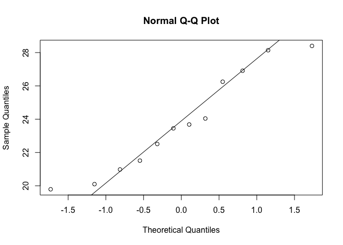
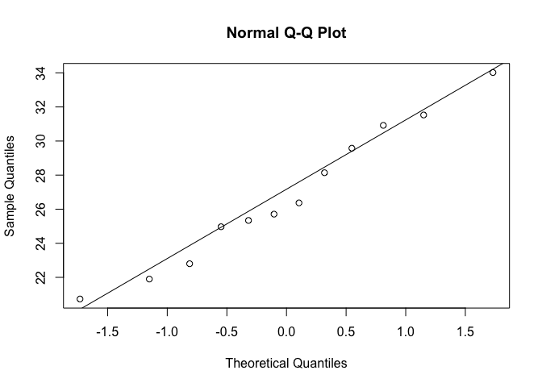

t-tests in practice pt. 2
================

Up to now, we have been focusing on understanding concepts, and have used population data we typically don't have access to. Now lets use data we would probabily have, constructing a t-statistic, computing a p-value and confidence intervals. We have two sets of 12 data points.

``` r
library(dplyr)
```

    ## Warning: package 'dplyr' was built under R version 3.4.4

    ## 
    ## Attaching package: 'dplyr'

    ## The following objects are masked from 'package:stats':
    ## 
    ##     filter, lag

    ## The following objects are masked from 'package:base':
    ## 
    ##     intersect, setdiff, setequal, union

``` r
dat <- read.csv("femaleMiceWeights.csv")

control <- filter(dat,Diet=="chow") %>%
  select(Bodyweight) %>% unlist
```

    ## Warning: package 'bindrcpp' was built under R version 3.4.4

``` r
treatment <- filter(dat,Diet=="hf") %>%
  select(Bodyweight) %>% unlist
```

We want to compute the mean difference, and estimate the standard error. A function in R does it for us, called the t-test function.

``` r
ttest <- t.test(treatment,control)
ttest
```

    ## 
    ##  Welch Two Sample t-test
    ## 
    ## data:  treatment and control
    ## t = 2.0552, df = 20.236, p-value = 0.053
    ## alternative hypothesis: true difference in means is not equal to 0
    ## 95 percent confidence interval:
    ##  -0.04296563  6.08463229
    ## sample estimates:
    ## mean of x mean of y 
    ##  26.83417  23.81333

We can see that the t-statistic is 2.0552 (what we got when dividing obs by se), the p-value is 0.053, and there is a 95% confidence interval. Earlier when using the CLT, the p-value was smaller. This is because here we are NOT assuming that the CLT applies to the t-statistic, we are instead using the t-distribution approximation. The t-distribution has bigger tails, thus we get a smaller p-value.
The assumption we make when using that distribution is that the original mouse data is normally distributed, meaning that if we had access to the ENTIRE population, it would be normally distributed. Let's look at the q-q norm of the controls and a q-q norm of the treatment group.

``` r
qqnorm(control)
qqline(control)
```



``` r
qqnorm(treatment)
qqline(treatment)
```



There are only 12 points so its not a perfect check of assumptions, but we can see that it is not too off the normal distribution, meaning that using the t-distribution is probably OK.
