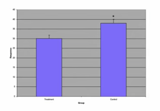
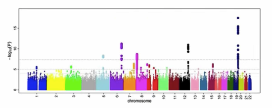

Introduction to Inference
================

In the previous week, random variables and normal distributions were explained. The next stage is to introduce the details of statistical inference. In journals, there are often bar plots with antannae and a little star.

In Genome-Wide Association study paper,you will see these Manhattan plots.

We want to understand this because in science its very common to ask if two things are different. Do smokers' babies weigh less than nonsmokers' babies? Is the risk of cancer different? Are the genotypes of these loci different in type 2 diabetes compared to control patients? Is this gene differentially expressed when you compare a tumour and a normal sample?

When we take two measurements and compare, we almost always see some difference. But will we see it again if we measure again? Is it *reproducible*. Statistical inference tries to quantify this, and answer these questions using mathematics and science.
