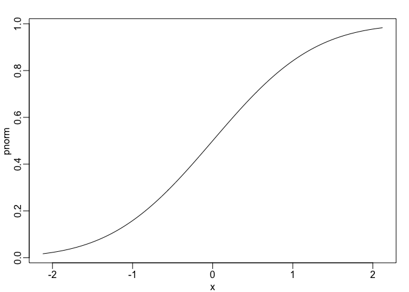

T-test Exercises
================

``` r
library(rafalib)
library(dplyr)
```

    ## Warning: package 'dplyr' was built under R version 3.4.4

    ## 
    ## Attaching package: 'dplyr'

    ## The following objects are masked from 'package:stats':
    ## 
    ##     filter, lag

    ## The following objects are masked from 'package:base':
    ## 
    ##     intersect, setdiff, setequal, union

``` r
library(downloader)
```

These exercises loads the babies dataset from babies.txt. The data will be used to review the concepts behind p-values and then test confidence interval concepts.

``` r
url <- "https://raw.githubusercontent.com/genomicsclass/dagdata/master/inst/extdata/babies.txt"
filename <- basename(url)
download(url, destfile=filename)
babies <- read.table("babies.txt", header=TRUE)
```

This is a large dataset (1,236 cases) and we pretend that it contains the entire population in which we are interested. We will study the differences in birth weight between babies born to smoking and non-smoking mothers.

First, split data into two birth weight datasets

``` r
bwt.nonsmoke <- filter(babies,smoke==0) %>% select(bwt) %>% unlist
```

    ## Warning: package 'bindrcpp' was built under R version 3.4.4

``` r
bwt.smoke <- filter(babies,smoke==1) %>% select(bwt) %>% unlist
```

Now we can look for the true population difference in means between smoking and non-smoking birth weights.

``` r
mean(bwt.nonsmoke)-mean(bwt.smoke)
```

    ## [1] 8.937666

``` r
popsd(bwt.nonsmoke)
```

    ## [1] 17.38696

``` r
popsd(bwt.smoke)
```

    ## [1] 18.08024

The population difference of mean birth weights is about 8.9 ounces. The standard deviations of the nonsmoking and smoking groups are about 17.5 and 18.1 ounces.

In the following questions, we treat the babies dataset as the full population and draw samples from it to simulate individual experiments. We will then ask whether somebody who only receieved the random samples would be able to draw correct conclusions about the population.

We are interested in testing whether the birth weights of babies born to non-smoking mothers are significantly different from the birth weights of babies born to smoking mothers.

### T-test Exercise 1

Set the seed at 1 and obtain a samples from the non-smoking mothers (dat.ns) of size . Then, without resetting the seed, take a sample of the same size from and smoking mothers (dat.s). Compute the t-statistic (call it tval).

``` r
set.seed(1)
dat.ns <- sample(bwt.nonsmoke,25)
dat.s <- sample(bwt.smoke,25)
tval <- abs(t.test(dat.s,dat.ns)$statistic)
tval
```

    ##        t 
    ## 2.120904

### T-test exercise 2

Recall that we summarize our data using a t-statistic because we know that in situations where the null hypothesis is true (what we mean when we say "under the null") and the sample size is relatively large, this t-value will have an approximate standard normal distribution. Because we know the distribution of the t-value under the null, we can quantitatively determine how unusual the observed t-value would be if the null hypothesis were true.

The standard procedure is to examine the probability a t-statistic that actually does follow the null hypothesis would have larger absolute value than the absolute value of the t-value we just observed -- this is called a two-sided test.

We have computed these by taking one minus the area under the standard normal curve between -abs(tval) and abs(tval). In R, we can do this by using the pnorm function, which computes the area under a normal curve from negative infinity up to the value given as its first argument:

``` r
mypar()
plot(pnorm, xlim=c(-tval ,tval ))
```



``` r
2*(1 - (pnorm(tval)))
```

    ##          t 
    ## 0.03392985

### T-test exercise 3

Because of the symmetry of the standard normal distribution, there is a simpler way to calculate the probability that a t-value under the null could have a larger absolute value than tval. Choose the simplified calculation from the following:

``` r
2*pnorm(-abs(tval))
```

    ##          t 
    ## 0.03392985

### T-test exercise 4

By reporting only p-values, many scientific publications provide an incomplete story of their findings. As we have mentioned, with very large sample sizes, scientifically insignificant differences between two groups can lead to small p-values. Confidence intervals are more informative as they include the estimate itself. Our estimate of the difference between babies of smoker and non-smokers: mean(dat.s) - mean( dat.ns). If we use the CLT, what quantity would we add and subtract to this estimate to obtain a 99% confidence interval?

``` r
mean(dat.s)-mean(dat.ns)
```

    ## [1] -9.92

``` r
N <- 25
qnorm(1-0.005)*sqrt( sd( dat.ns)^2/N + sd( dat.s)^2/N )
```

    ## [1] 12.0478

0.99 interval, 1-0.99/2 = 0.005. z value by doing qnorm(1-0.005). Then multiply z value by the square root of (sd1^2/N + sd2^2/N). To get confidence intervals you add and subtract this from the mean
