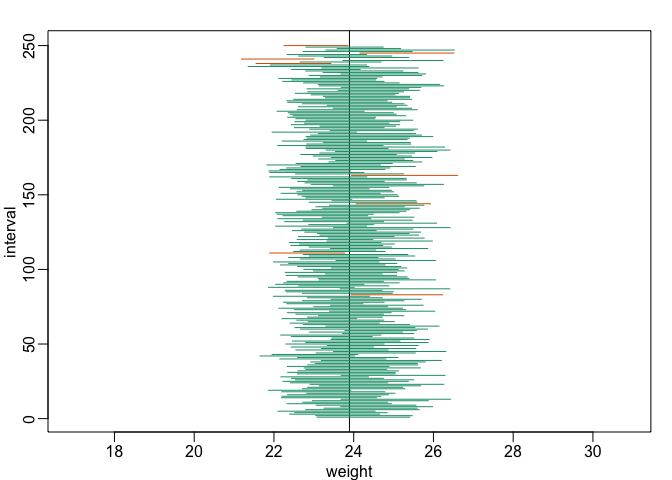
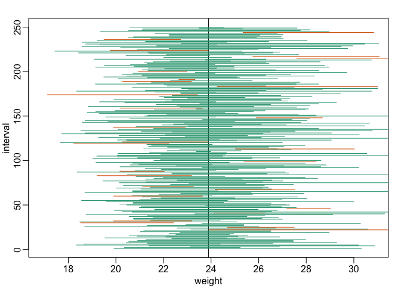
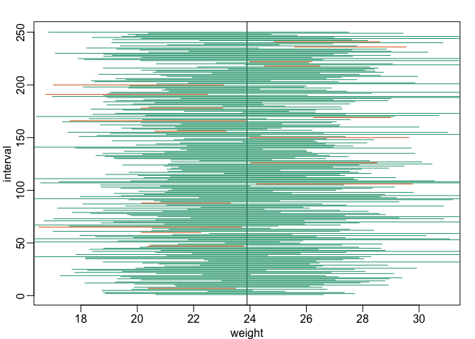

Confidence Intervals
================

Explaining the concept of a confidence interval.

``` r
set.seed(1)
chowPopulation <- read.csv("femaleControlsPopulation.csv")
chowPopulation <- unlist(chowPopulation)

mu_chow <- mean(chowPopulation)
mu_chow
```

    ## [1] 23.89338

The mean of the population data for the females on the chow diet is 23.89. This is the parameter - the truth- that we are trying to estimate.

In practice, we are going to get a sample.

``` r
N <- 30
chow <- sample(chowPopulation,N)
print(mean(chow))
```

    ## [1] 23.351

We take a sample of 30 mice, and now get a different mean. As expected, the sample mean is not exactly the same as the population mean, because its a random variable.

So what we do now, is create an interval based on the 30 data points that we have, that we will be quite certain will fall on top of the true parameter (which in practice, we don't know). So we take advantage of the central limit theorem.

We assume that the sample average is normally distributed. We can then construct a random variable that is normally distributed (mean 0 and standard deviation 0). The first thing we do is compute the standard error, from the standard deviation of the sample divided by the sample size.

``` r
se <- sd(chow)/sqrt(N)
se
```

    ## [1] 0.4781652

Now we know that the mean(chow) - mean(chowPopulation) has mean 0. We know that the mean of the sample average is the population average, and if we divide by the standard error, then we have a normal 0 1 random variable.

``` r
(mean(chow)-mean(chowPopulation))/se
```

    ## [1] -1.13429

So we know that random variable 95% of the time will be between 2 and -2.

``` r
pnorm(2)-pnorm(-2)
```

    ## [1] 0.9544997

``` r
Q <- qnorm(1-0.05/2)
Q
```

    ## [1] 1.959964

More precisely, between -1.959964 and +1.959964 but 2 is a rounding off. So we know that this happens 95% of the time.

So we have -Q &lt; (mean(chow)-mean(chowPopulation))/se &lt; Q. If we clear out this equation so that the mean(chowPopulation), the true mean, is in the middle, we get this equation. (First multiply by se then subtract the sample mean)

``` r
interval <- c(mean(chow)-Q*se, mean(chow)+Q*se)
interval
```

    ## [1] 22.41381 24.28819

This interval is going to be on top of the mean of the population 95% of the time. Let's see if its true or false.

``` r
interval[1] < mu_chow & interval[2] > mu_chow
```

    ## [1] TRUE

We can do this several times and make a figure. Lets do it 250 times.

``` r
library(rafalib)
B <- 250
mypar()
plot(mean(chowPopulation)+c(-7,7),c(1,1),type="n",xlab="weight",ylab="interval",ylim=c(1,B))
abline(v=mean(chowPopulation))
for (i in 1:B) {
  chow <- sample(chowPopulation,N)
  se <- sd(chow)/sqrt(N)
  interval <- c(mean(chow)-Q*se,mean(chow)+Q*se)
  covered <-
    mean(chowPopulation) <= interval[2] & mean(chowPopulation) >= interval[1]
  color <-ifelse(covered,1,2)
  lines(interval, c(i,i),col=color)
}
```

 The red lines indicate that the mean is not on top of the interval, this happens around 5% of the time. So this worked out quite well. Lets do it again with sample sizes of 5.

``` r
N <- 5
B <- 250
mypar()
plot(mean(chowPopulation)+c(-7,7),c(1,1),type="n",xlab="weight",ylab="interval",ylim=c(1,B))
abline(v=mean(chowPopulation))
for (i in 1:B) {
  chow <- sample(chowPopulation,N)
  se <- sd(chow)/sqrt(N)
  interval <- c(mean(chow)-Q*se,mean(chow)+Q*se)
  covered <-
    mean(chowPopulation) <= interval[2] & mean(chowPopulation) >= interval[1]
  color <-ifelse(covered,1,2)
  lines(interval, c(i,i),col=color)
}
```

 Much more red lines! Much more than 5%, and this is because we did not make the intervals big enough. the Q that we computed is not right any more, as it was based on the CLT. We assumed the random variable was normal, so we used qnorm. It is not the case any more, so the intervals are not right. So let us do it again, but instead of finding Q with qnorm, we use the t-distribution approximation. We use qt instead of qnorm, and get a larger value (2.77).

``` r
N <- 5
B <- 250
Q <- qt(1-0.05/2,df=4)
mypar()
plot(mean(chowPopulation)+c(-7,7),c(1,1),type="n",xlab="weight",ylab="interval",ylim=c(1,B))
abline(v=mean(chowPopulation))
for (i in 1:B) {
  chow <- sample(chowPopulation,N)
  se <- sd(chow)/sqrt(N)
  interval <- c(mean(chow)-Q*se,mean(chow)+Q*se)
  covered <-
    mean(chowPopulation) <= interval[2] & mean(chowPopulation) >= interval[1]
  color <-ifelse(covered,1,2)
  lines(interval, c(i,i),col=color)
}
```

 As a result, we get less red, because we have bigger intervals. So when you can't use CLT, use the t-distribution. The only change is how you compute the Q- the size of the interval as a function of your estimated standard error.
