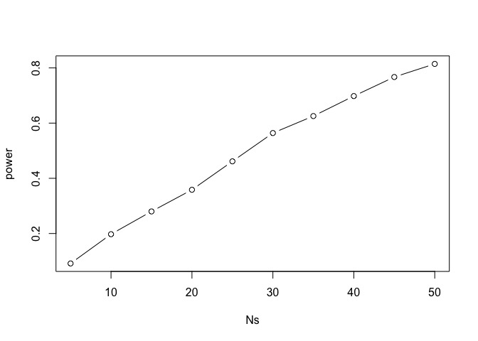

Power Calculations
================

Here, we will describe power calculations, and define what statistical power means. To do this, we will use a data set that includes the population of mice for both the high fat and control.

``` r
library(dplyr)
```

    ## Warning: package 'dplyr' was built under R version 3.4.4

    ## 
    ## Attaching package: 'dplyr'

    ## The following objects are masked from 'package:stats':
    ## 
    ##     filter, lag

    ## The following objects are masked from 'package:base':
    ## 
    ##     intersect, setdiff, setequal, union

``` r
dat <- read.csv("mice_pheno.csv")

controlPopulation <- filter(dat,Sex =="F" & Diet=="chow") %>%
  select(Bodyweight) %>% unlist
```

    ## Warning: package 'bindrcpp' was built under R version 3.4.4

``` r
hfPopulation <- filter(dat,Sex =="F" & Diet=="hf") %>%
  select(Bodyweight) %>% unlist
```

Now that we have both controls and high fat mice, we can calculate the true parameters, the two means. We can see that they are different.

``` r
mu_hf <- mean(hfPopulation)
mu_control <- mean(controlPopulation)
mu_hf - mu_control
```

    ## [1] 2.375517

If we do a statistical test and are successful, we should reject the null hypothesis because the difference in weight is in fact there. The difference is pretty large (almost 10%), so it is a scientifically *important* difference.

``` r
(mu_hf - mu_control)/mu_control * 100
```

    ## [1] 9.942157

In practice, we should perform a test and reject the null hypothesis. So let's show what power means. Now we need to take a sample of 5 mice from both populations (control and high fat). Then, we run a t-test.

``` r
set.seed(1)
N <- 5
hf <- sample(hfPopulation,N)
control <- sample(controlPopulation, N)
t.test(hf,control)$p.value
```

    ## [1] 0.1410204

We get a p-value of 0.14 using the standard cutoffs. So we don't reject, and say no there is not enough evidence to reject a null, so we miss the result and don't actually find that they are different. This is what we call a Type II error.
This is a mistake, we failed to reject. It happened because this is random data, our sample size was too small in this case.
Let's try with a sample size of 12

``` r
N <- 12
hf <- sample(hfPopulation,N)
control <- sample(controlPopulation, N)
t.test(hf,control)$p.value
```

    ## [1] 0.07314376

P-value is now 0.07, still not rejected. What about a sample size of 30?

``` r
N <- 30
hf <- sample(hfPopulation,N)
control <- sample(controlPopulation, N)
t.test(hf,control)$p.value
```

    ## [1] 0.001718212

Now we get a p-value of .001. The point of this was to show that it is posible to make a Type II error, and it is quite possible to make it when you have a small sample size. So power helps us to quantify this.
Let us make N 12 again, and define alpha as 0.05. Alpha is the character we use to name the *cutoff* at which we reject the hypothesis if the p-value is smaller than 0.05. This is the standard cutoff value usually used.

``` r
N <- 12
hf <- sample(hfPopulation,N)
control <- sample(controlPopulation, N)
alpha <- 0.05
```

Now we run a simulation 2000 times, and over and over again run t-tests. First, we define a function called 'reject', that for a given N, runs a t-test and says true or false (did you reject or not). We can then see what proportion of the time we rejected - remember, we WANT to reject!

``` r
B <- 2000
reject <- function(N, alpha=0.05){
  hf <- sample(hfPopulation,N)
  control <-sample(controlPopulation,N)
  pval <- t.test(hf, control)$p.value
  pval < alpha
}
rejections <- replicate(B,reject(N))
mean(rejections)
```

    ## [1] 0.253

We can see that 25% of the time we did the right thing, and rejected the hypothesis. This is power - the probability of rejecting the hypothesis when the alternative is true. And 25% is not considered high. In this case, to increase the power, you would have had to have selected a larger N. Let's try again using the sapply command to redo what we just did for several values of N.

``` r
Ns <- seq(5,50,5)

power <- sapply(Ns,function(N){
  rejections <- replicate(B,reject(N))
  mean(rejections)
})

plot(Ns, power, type="b")
```

 We can see that as N gets bigger, power increases, and at for the first set we looked at with N = 12, we can see that we had low power to detect real differences.
