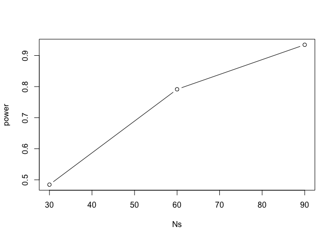

Power Calculations Exercises
================

``` r
library(downloader)
library(rafalib)
library(dplyr)
```

    ## Warning: package 'dplyr' was built under R version 3.4.4

    ## 
    ## Attaching package: 'dplyr'

    ## The following objects are masked from 'package:stats':
    ## 
    ##     filter, lag

    ## The following objects are masked from 'package:base':
    ## 
    ##     intersect, setdiff, setequal, union

``` r
url <- "https://raw.githubusercontent.com/genomicsclass/dagdata/master/inst/extdata/babies.txt"
filename <- basename(url)
download(url, destfile=filename)
babies <- read.table("babies.txt", header=TRUE)

bwt.nonsmoke <- filter(babies, smoke==0) %>% select(bwt) %>% unlist 
```

    ## Warning: package 'bindrcpp' was built under R version 3.4.4

``` r
bwt.smoke <- filter(babies, smoke==1) %>% select(bwt) %>% unlist

mean(bwt.nonsmoke)-mean(bwt.smoke)
```

    ## [1] 8.937666

``` r
popsd(bwt.nonsmoke)
```

    ## [1] 17.38696

``` r
popsd(bwt.smoke)
```

    ## [1] 18.08024

### Power calculations 1

We can explore the trade off of power and Type I error concretely using the babies data. Since we have the full population, we know what the true effect size is (about 8.93) and we can compute the power of the test for true difference between populations.

Set the seed at 1 and take a random sample of N=5 measurements from each of the smoking and nonsmoking datasets. You used the t-test function to find the p-value.

The p-value is larger than 0.05 so using the typical cut-off, we would not reject. This is a type II error. Which of the following is *not* a way to decrease this type of error?

``` r
set.seed(1)
N <- 5
data.ns <- sample(bwt.nonsmoke,N)
data.s <- sample(bwt.smoke,N)
t.test(data.ns,data.s)$p.value
```

    ## [1] 0.1366428

Find a population for which the null is not true.

### Power calculations 2

Set the seed at 1, then use the replicate function to repeat the code used in the exercise above 10,000 times. What proportion of the time do we reject at the 0.05 level?

``` r
B <- 10000
reject <- function(N, alpha=0.05){
  data.ns <- sample(bwt.nonsmoke,N)
  data.s <- sample(bwt.smoke,N)
  pval <- t.test(data.ns,data.s)$p.value
  pval < alpha
}
rejections <- replicate(B,reject(N))
mean(rejections)
```

    ## [1] 0.0984

### Power calculations 3

Note that, not surprisingly, the power is lower than 10%. Repeat the exercise above for samples sizes of 30, 60, 90 and 120. Which of those four gives you power of about 80%?

``` r
Ns <- seq(30,90,30)

power <- sapply(Ns,function(N){
  rejections <- replicate(B,reject(N))
  mean(rejections)
})

plot(Ns, power, type="b")
```

 60.

### Power calculations 4

Repeat the problem above, but now require an level of 0.01. Which of those four gives you power of about 80%?

``` r
B <- 10000
N <- 5
reject <- function(N, alpha=0.01){
  data.ns <- sample(bwt.nonsmoke,N)
  data.s <- sample(bwt.smoke,N)
  pval <- t.test(data.ns,data.s)$p.value
  pval < alpha
}
rejections <- replicate(B,reject(N))
power1 <- mean(rejections)

Ns <- seq(30,90,30)

power <- sapply(Ns,function(N){
  rejections <- replicate(B,reject(N))
  mean(rejections)
})

powers <- c(power1, power)
size <- c(N,Ns)
plot(size, powers, type="b")
```

 90
