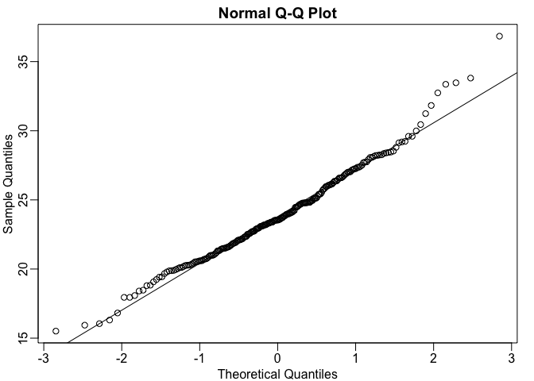

Monte Carlo Simulation
================

This page will describe Monte Carlo simulations. Simulations can be used to check theoretical or analytical results. Many theoretical results used in statistics are based on asymptotics; they hold when the sample size goes to infinity. We never have an infinite number of samples so we may want to know how well the theory works with our actual sample size. Simulations are useful in this case.

To set the scene, what we will do now is do a Monte Carlo simulation to test out the t-distribution approach and how well it works. First we load up the control population again, from which we will sample as before.

``` r
set.seed(1)
library(rafalib)

dat <- read.csv("mice_pheno.csv")
controlPopulation <- read.csv("femaleControlsPopulation.csv")
controlPopulation <- unlist(controlPopulation)
```

Now we will create a function called "ttestgenerator", that for any given sample size n, it takes a random sample from the control population for cases and controls. It generates a t-statistic under the null hypothesis.

``` r
ttestgenerator <- function(n) {
  cases <- sample(controlPopulation,n)
  controls <- sample(controlPopulation,n)
  tstat <- (mean(cases)-mean(controls))/ sqrt(var(cases)/n + var(controls)/n)
  return(tstat) 
}
ttests <- replicate(1000,ttestgenerator(10))
```

We are generating 1000 t-statistics with a sample size of 10. This is a Monte Carlo simulation, generating random variables using a computer. A common way these are used is to test approximations and how well they work. For example we can change the sample size and see what happens.

``` r
hist(ttests)
```

 We can see it looks like a normal distribution, so the normal approximation works pretty well here. So from this Monte Carlo simulation we would conclude that CLT works well for this particular data set when the sample size is 10.

``` r
qqnorm(ttests)
abline(0,1)  
```

 We can try again with a sample size of 3.

``` r
ttests <- replicate(1000,ttestgenerator(3))
mypar()
hist(ttests)
```


``` r
qqnorm(ttests)
abline(0,1)
```

 The approximation is not as good. The qq-plot plots q-values from the normal distribution against the Monte Carlo values, and shows that the approximation is worse. Now we see that the large quantiles, referred to by statisticians as the *tails*, are larger than expected (below the line on the left side of the plot and above the line on the right side of the plot). In the previous module, we explained that when the sample size is not large enough and the population values follow a normal distribution, then the t-distribution is a better approximation than CLT. Our simulation results seem to confirm this.

``` r
ps <- (seq(0,999)+0.5)/1000
qqplot(qt(ps,df=2*3-2),ttests,xlim=c(-6,6),ylim=c(-6,6))
abline(0,1)
```

 The t-distribution is a much better approximation in this case, but still not perfect. This is because the original data is *not* that well approximated by the normal distribution.

``` r
mypar()
hist(controlPopulation)
```


``` r
qqnorm(controlPopulation)
qqline(controlPopulation)
```

 We normally don't have population data, so one thing we can do instead is generate population data. If we say that the population is roughly normally distributed, we can say the mice weights are about 24, the sd is 3.5. We can generate a control population of 5000 using a parametric Monte-Carlo using rnorm.

``` r
controls <- rnorm(5000,mean=24,sd=3.5)
```

We can repeat the t-test generator again. This time, instead of randomly sampling from the population, we generate normally distributed random variables. This new function therefore requires no data at all and is completely computer generated.

``` r
ttestgenerator <- function(n, mean=24, sd=3.5) {
  cases <- rnorm(n,mean,sd)
  controls <- rnorm(n,mean,sd)
  tstat <- (mean(cases)-mean(controls))/ sqrt(var(cases)/n + var(controls)/n)
  return(tstat) 
}
ttests <- replicate(1000,ttestgenerator(10))
mypar()
hist(ttests)
```


``` r
qqnorm(ttests)
abline(0,1)
```

 So using a parametric random number generator to create the population data, we got a good approximation.
