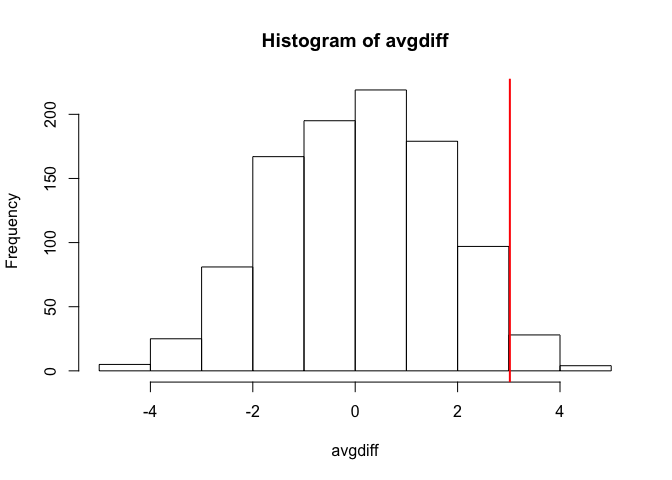
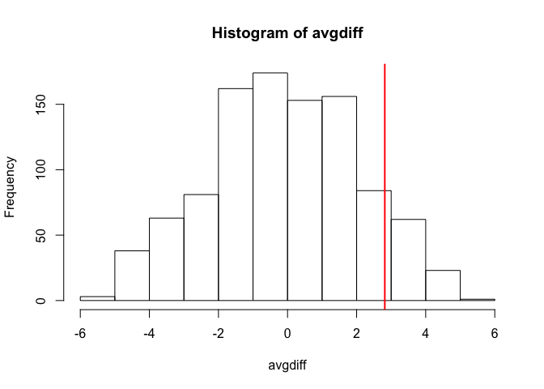

Permutation Tests
================

Suppose we have a situation in which none of the standard mathematical statistical approximations apply. We have computed a summary statistic, such as the difference in mean, but do not have a useful approximation, such as that provided by the CLT. In practice, we do not have access to all values in the population so we can’t perform a simulation as done above. Permutation tests can be useful in these scenarios.
We are back to the scenario where we only have 10 measurements for each group.

``` r
set.seed(1)

dat=read.csv("femaleMiceWeights.csv")

library(dplyr)
```

    ## Warning: package 'dplyr' was built under R version 3.4.4

    ## 
    ## Attaching package: 'dplyr'

    ## The following objects are masked from 'package:stats':
    ## 
    ##     filter, lag

    ## The following objects are masked from 'package:base':
    ## 
    ##     intersect, setdiff, setequal, union

``` r
control <- filter(dat,Diet=="chow") %>% select(Bodyweight) %>% unlist
```

    ## Warning: package 'bindrcpp' was built under R version 3.4.4

``` r
treatment <- filter(dat,Diet=="hf") %>% select(Bodyweight) %>% unlist
obsdiff <- mean(treatment)-mean(control)
```

In previous sections, we showed parametric approaches that helped determine if the observed difference was significant. Permutation tests take advantage of the fact that if we randomly shuffle the cases and control labels, then the null is true. So we shuffle the cases and control labels and assume that the ensuing distribution approximates the null distribution. Here is how we generate a null distribution by shuffling the data 1,000 times:

``` r
N <- 12
avgdiff <- replicate(1000, {
    all <- sample(c(control,treatment))
    newcontrols <- all[1:N]
    newtreatments <- all[(N+1):(2*N)]
  return(mean(newtreatments) - mean(newcontrols))
})
hist(avgdiff)
abline(v=obsdiff, col="red", lwd=2)
```



How many of the null means are bigger than the observed value? That proportion would be the p-value for the null. We add a 1 to the numerator and denominator to account for misestimation of the p-value.

``` r
#the proportion of permutations with larger difference
(sum(abs(avgdiff) > abs(obsdiff)) + 1) / (length(avgdiff) + 1)
```

    ## [1] 0.06293706

Now let’s repeat this experiment for a smaller dataset. We create a smaller dataset by sampling, and then repeat the exercise.

``` r
N <- 5
control <- sample(control,N)
treatment <- sample(treatment,N)
obsdiff <- mean(treatment)- mean(control)

avgdiff <- replicate(1000, {
    all <- sample(c(control,treatment))
    newcontrols <- all[1:N]
    newtreatments <- all[(N+1):(2*N)]
  return(mean(newtreatments) - mean(newcontrols))
})
hist(avgdiff)
abline(v=obsdiff, col="red", lwd=2)
```



``` r
(sum(abs(avgdiff) > abs(obsdiff)) + 1) / (length(avgdiff) + 1)
```

    ## [1] 0.2077922

Now the observed difference is not significant using this approach. Keep in mind that there is no theoretical guarantee that the null distribution estimated from permutations approximates the actual null distribution. For example, if there is a real difference between the populations, some of the permutations will be unbalanced and will contain some samples that explain this difference. This implies that the null distribution created with permutations will have larger tails than the actual null distribution. This is why permutations result in conservative p-values. For this reason, when we have few samples, we can’t do permutations.
Note also that permutations tests still have assumptions: samples are assumed to be independent and “exchangeable”. If there is hidden structure in your data, then permutation tests can result in estimated null distributions that underestimate the size of tails because the permutations may destroy the existing structure in the original data.
