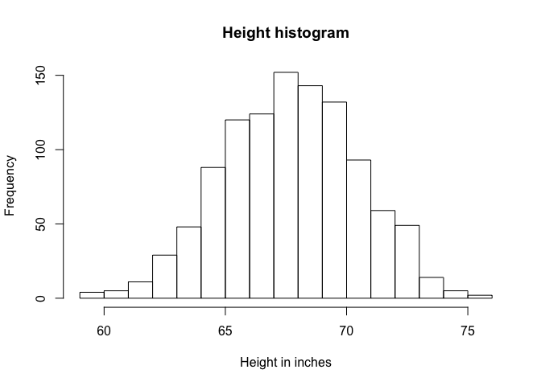
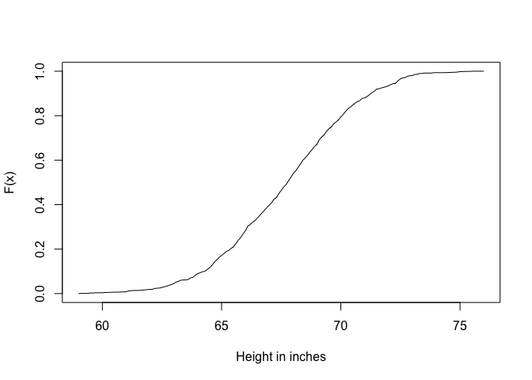

Histograms
================

We can think of any given dataset as a list of numbers. Suppose you have measured the heights of all men in a population. To motivate the use of the histogram we will pretend that we want to describe or summarise this data to someone who has no idea how heights are distributed.

``` r
library(UsingR)
```

    ## Warning: package 'UsingR' was built under R version 3.4.4

    ## Warning: package 'HistData' was built under R version 3.4.4

    ## Warning: package 'Formula' was built under R version 3.4.4

    ## Warning: package 'ggplot2' was built under R version 3.4.4

``` r
x <- father.son$fheight
length(x)
```

    ## [1] 1078

We have 1078 individuals, so reporting every single height wouldn't be convenient. We can use a sample function to report a sample of 20. *Round* rounds the number to the nearest 10th of an inch.

``` r
round(sample(x,20),1)
```

    ##  [1] 68.6 66.1 64.9 72.3 64.4 67.9 67.7 71.5 67.5 67.1 69.0 65.4 70.0 73.0
    ## [15] 69.1 70.2 69.8 69.6 61.8 62.4

However this may not be very informative. The best way is a visual description of the data as a histogram.

``` r
hist(x,breaks=seq(floor(min(x)),ceiling(max(x))),
     main="Height histogram",xlab="Height in inches")
```

 The "breaks" argument tells the function where to draw intervals and report the number of individuals for each of those intervals. We have decided to look at the following breaks - 59 to 60, 60 to 61 etc. up to 76. The histogram gives us a good idea of the numbers included in our data set.

### Empirical Cumulative Density Function

These plots are related to the histogram. What it does is report for any given number the % of individuals below that threshold. Here we will look at these thresholds contained in xs.

``` r
xs <- seq(floor(min(x)),ceiling(max(x)),0.1)
plot(xs,ecdf(x)(xs),type="l",
     xlab="Height in inches",ylab="F(x)")
```

 This is similar to the histogram. You can see that for example 70 to 75% of individuals are shorter than 80 inches
