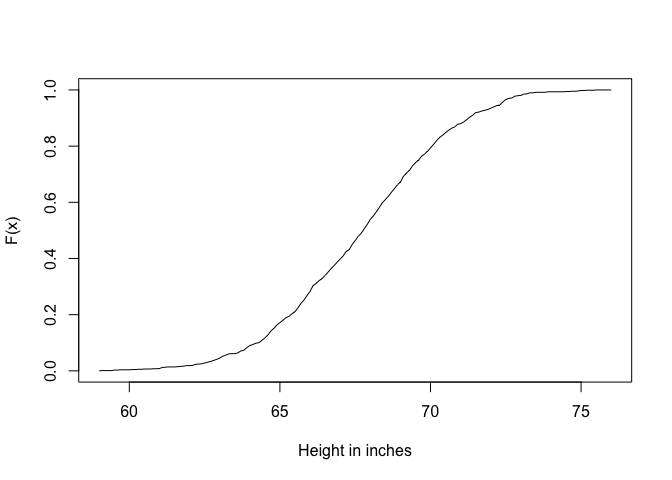
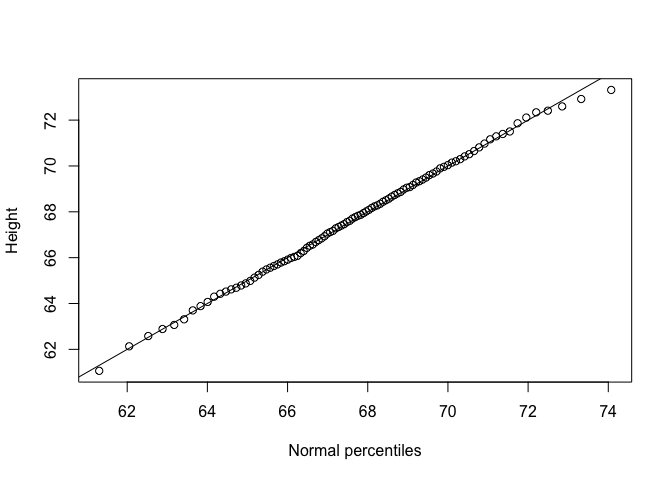
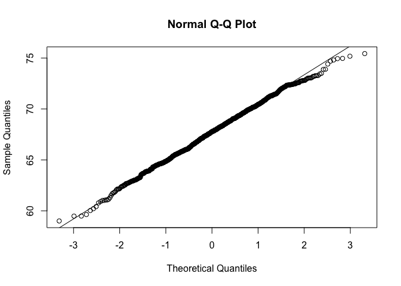

QQ-Plot
================

Reporting the proportion of data points in a series of intervals through a histogram is very useful. We learned about the normal distribution; if the distribution of heights is approximately normal, then all we need to summarise it is the mean and the standard deviation.

``` r
library(UsingR)
```

    ## Warning: package 'UsingR' was built under R version 3.4.4

    ## Warning: package 'HistData' was built under R version 3.4.4

    ## Warning: package 'Formula' was built under R version 3.4.4

    ## Warning: package 'ggplot2' was built under R version 3.4.4

``` r
x <- father.son$fheight
mean(x)
```

    ## [1] 67.6871

``` r
sd(x)
```

    ## [1] 2.744868

``` r
xs <- seq(floor(min(x)),ceiling(max(x)),0.1)
plot(xs,ecdf(x)(xs),type="l",
     xlab="Height in inches",ylab="F(x)")
```

 The mean is around 67.7 inches and the standard deviation around 2.75 inches. If the distribution of our data is normal, then if we want to compute e.g. the proportion of individuals taller than 70, we just need to use the normal approximation with this mean and sd.

``` r
mean(x>70)
```

    ## [1] 0.2059369

``` r
1-pnorm(70,mean(x),sd(x))
```

    ## [1] 0.1997182

The empirical result shows that around 20% of the individuals are taller than 70, as does the normal distribution. Let's switch it to smaller than 70. We now don't need the 1- as we are looking at the left part of the distribution.

``` r
mean(x<70)
```

    ## [1] 0.7940631

``` r
pnorm(70,mean(x),sd(x))
```

    ## [1] 0.8002818

Both close to 80. If we continue this approach and check to see if both agree, then we can start to conclude that the normal distribution is a good approximation. To do this systematically we can use a Quantile-Quantile or QQ plot.

``` r
ps <- seq(0.01,0.99,0.01)
qs <- quantile(x,ps)
normalqs <-qnorm(ps,mean(x),sd(x))
plot(normalqs,qs,xlab="Normal percentiles",ylab="Height")
abline(0,1)
```

 We are looking at the percentiles from 1% to 99%. We compute the percentiles for our data and for the normal distribution. Then we compare them to see how similar they are. There is also an easier function, the QQ norm function, specific to the normal distribution.

``` r
qqnorm(x)
qqline(x)
```


