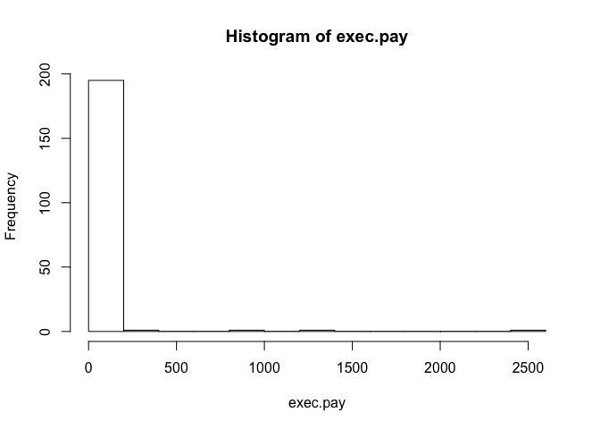
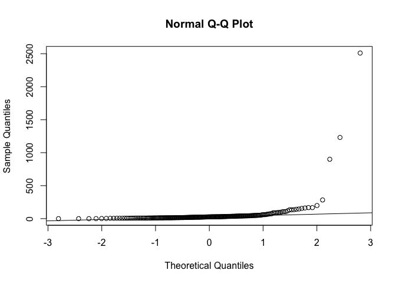
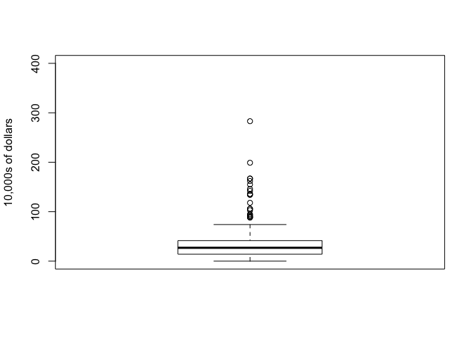

Boxplots
================

When data is not normally distributed, then the mean and standard deviation are not necessarily good summaries.

An example of this data is salaries. Using the rafalib library, there is a data set with salaries of executives.

``` r
library(rafalib)
library(UsingR)
```

    ## Warning: package 'UsingR' was built under R version 3.4.4

    ## Warning: package 'HistData' was built under R version 3.4.4

    ## Warning: package 'Formula' was built under R version 3.4.4

    ## Warning: package 'ggplot2' was built under R version 3.4.4

``` r
hist(exec.pay)
```

 This data is definitely not normal. We can also make a QQ plot.

``` r
qqnorm(exec.pay)
qqline(exec.pay)
```

 We have what statisticians call a "fat right tail", there are points that are much larger than expected compared to a normal distribution. So if we were to describe this data to someone, we would not tel them the mean and standard deviation, as it would not give a good idea of the distribution of the data. Instead, a much better summary is a box plot.

``` r
boxplot(exec.pay,ylab="10,000s of dollars",ylim=c(0,400))
```

 The boxplot shows the median (thick black line- 50th percentile), then the line above it is the 75th percentile and the line below it the 25th. The two lines at the top and bottom represent the maximum and minimum values. The other points are the outliers.

``` r
mean(exec.pay)
```

    ## [1] 59.88945

``` r
median(exec.pay)
```

    ## [1] 27
