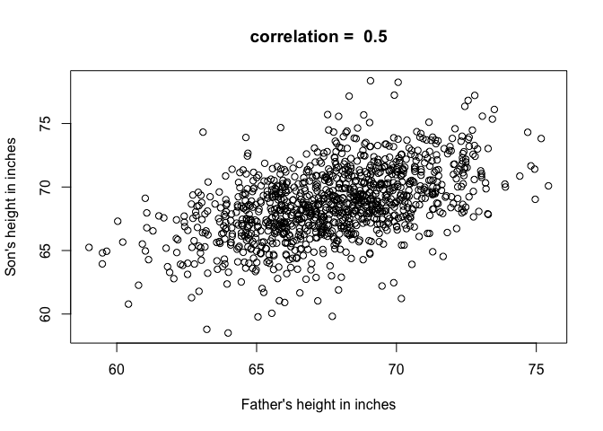
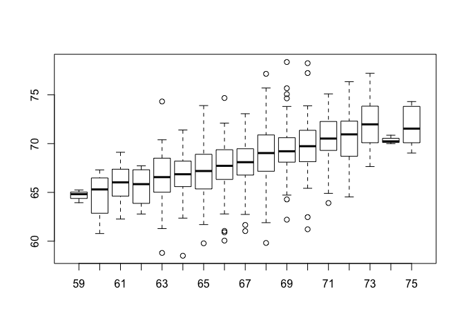
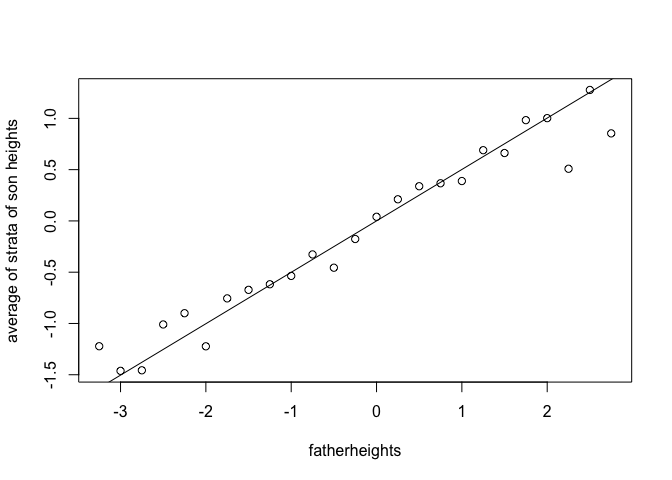
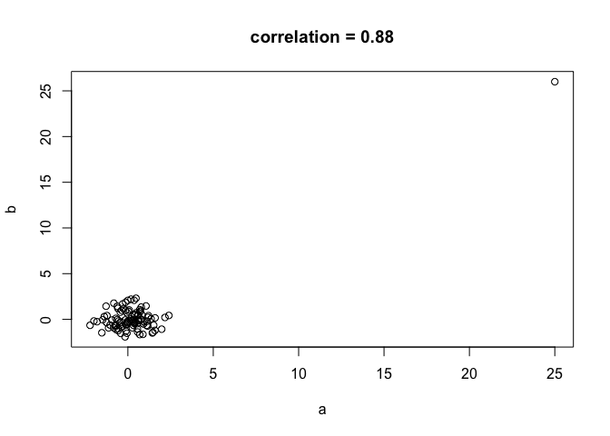

Scatterplot
================

We are going to look at two dimensional data. For example, the heights for fathers and sons. Let us make a scatter plot.

``` r
library(UsingR)
```

    ## Warning: package 'UsingR' was built under R version 3.4.4

    ## Loading required package: MASS

    ## Loading required package: HistData

    ## Warning: package 'HistData' was built under R version 3.4.4

    ## Loading required package: Hmisc

    ## Loading required package: lattice

    ## Loading required package: survival

    ## Loading required package: Formula

    ## Warning: package 'Formula' was built under R version 3.4.4

    ## Loading required package: ggplot2

    ## Warning: package 'ggplot2' was built under R version 3.4.4

    ## 
    ## Attaching package: 'Hmisc'

    ## The following objects are masked from 'package:base':
    ## 
    ##     format.pval, units

    ## 
    ## Attaching package: 'UsingR'

    ## The following object is masked from 'package:survival':
    ## 
    ##     cancer

``` r
x <- father.son$fheight
y <- father.son$sheight 
plot(x,y,xlab="Father's height in inches",ylab="Son's height in inches", main=paste("correlation = ",signif(cor(x,y),2)))
```

 From this plot we can see that there is a trend. As the father's height goes up, so does the son's. This characteristic is best summarised by the correlation. To compute the correlation we simply standardise the units, then multiply them together, and take the mean of that.

When data is normally distributed and 2D, the correlation adds extra information we need so that we can describe the proportion of data in any given 2D interval. It also helps us make predictions. Suppose you are asked to predict the height of a person randomly selected among the sons. Because the data is normally distributed, you know that the average is the best guess - the place you have more people than any other height. If we then say that we know that the father's height is 72 inches, how does this change the prediction for the son?

We wouldn't use the mean now, as we know that the son has a taller than average father, and we would expect the son to be taller than average. We get an idea of this by stratifying the data. We stratify by father's height, creating groups by having father heights in common (inch by inch). We then plot the heights of the sons with fathers with these heights.

``` r
boxplot(split(y,round(x)))
```



``` r
print(mean(y[round(x)==72]))
```

    ## [1] 70.67719

We find a linear trend. We can also predict the average son height for a father of 72 inches. - 70.67.

We want to interpret what this correlation means, so lets standardise the data to make it simpler. We put the father and son heights in standard units, then make a plot showing the mean of each one of these strata. Tapply is used to compute the mean of each group determined by rounding the heights to the closest quarter. We can see that for the fathers that are -1.75 standard units away from the mean, the average height of the sons was -0.75 units away.

``` r
x<-(x-mean(x))/sd(x)
y<-(y-mean(y))/sd(y)
means <- tapply(y,round(x*4)/4,mean)
means
```

    ##       -3.25          -3       -2.75        -2.5       -2.25          -2 
    ## -1.22199798 -1.46203527 -1.45660426 -1.00962327 -0.90000150 -1.22270676 
    ##       -1.75        -1.5       -1.25          -1       -0.75        -0.5 
    ## -0.75534207 -0.67217309 -0.61751433 -0.53635208 -0.32675762 -0.45624462 
    ##       -0.25           0        0.25         0.5        0.75           1 
    ## -0.17639095  0.04041397  0.21112281  0.33833123  0.36710697  0.38892744 
    ##        1.25         1.5        1.75           2        2.25         2.5 
    ##  0.68976726  0.66227097  0.98279070  1.00237256  0.50876809  1.27713491 
    ##        2.75 
    ##  0.85382776

Then we extract the father heights by taking the names from the means vector and turning them into numbers, and make a plot.

``` r
fatherheights=as.numeric(names(means))
plot(fatherheights,means,ylab="average of strata of son heights")
abline(0,cor(x,y))
```

 The slope of that line is the correlation. So if you have two data sets that are normally distributed and they have some correlation, if you turn them into standard units, then the correlation is the slope of the line that you would use to predict variable y given variable x. However, we must be careful when using non-normal data when we use these summaries.

To illustarte, we generate some uncorrelated data and change the first value to a very large value for both lists.

``` r
set.seed(1)
a <- rnorm(100);a[1]=25
b <- rnorm(100);b[1]=26
plot(a,b,main=paste("correlation =",signif(cor(a,b),2)))
```

 You can see that the data is uncorrelated, but then theres that point there which makes the correlation very high.

``` r
cor(a,b,method="spearman")
```

    ## [1] 0.05837384
